# End-to-End Walkthrough

A hands-on guide to every feature in the Lakehouse Orchestrator platform. Start the stack with `docker compose up -d`, then follow the sections below in order or jump to the one you need.

**Prerequisites:** Docker Engine 20.10+, Docker Compose v2, at least 8 GB RAM allocated to Docker.

---

## Table of Contents

- [Architecture Overview](#architecture-overview)
- [1. Sales Pipeline (Manual Trigger)](#1-sales-pipeline-manual-trigger)
- [2. CSV Auto-Ingest (Automatic)](#2-csv-auto-ingest-automatic)
- [3. Data Quality Checks](#3-data-quality-checks)
- [4. Querying Data via Trino](#4-querying-data-via-trino)
- [5. Superset Dashboards](#5-superset-dashboards)
- [6. Monitoring & Observability](#6-monitoring--observability)
- [7. Troubleshooting](#7-troubleshooting)

---

## Architecture Overview

This platform implements a lakehouse architecture that ingests CSV data into an Apache Iceberg data lake and exposes it for SQL analytics and dashboarding. Apache Airflow orchestrates two ingestion pipelines -- one manual and one automatic -- that land data in SeaweedFS (an S3-compatible object store), register tables through an Iceberg REST Catalog, and make them queryable via Trino. Apache Superset provides the visualization layer. All services run as Docker Compose containers with Prometheus and Grafana providing observability.

### System Architecture

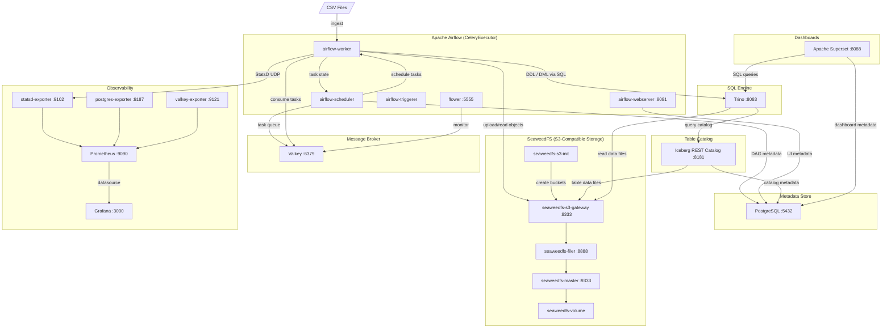

### Ingestion Pipelines

The platform provides two distinct ingestion paths. Use the sales pipeline for the built-in demo dataset, and the auto-ingest pipeline for any arbitrary CSV.

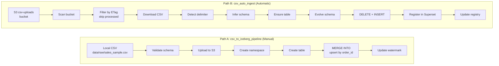

### DAG Summary

| DAG | Trigger | Purpose | Strategy |
|-----|---------|---------|----------|
| `csv_to_iceberg_pipeline` | Manual or scheduled | Ingest `sales_sample.csv` into `iceberg.lakehouse.sales` with predefined schema | `MERGE INTO` (upsert by `order_id`), watermark-based incremental extraction |
| `csv_auto_ingest` | Every 5 minutes (polling) | Discover and ingest any CSV uploaded to `s3://csv-uploads/` | `DELETE` + `INSERT` (replace per file), schema inference, auto-registers Superset datasets, ETag deduplication |
| `data_quality_checks` | Daily or manual | Run 8 validation checks on the `sales` table | SQL-based checks, results persisted to `_quality_results`, gate raises exception on failure |
| `iceberg_maintenance` | Daily at 03:00 UTC | Compact files, expire snapshots, remove orphans | `ALTER TABLE EXECUTE optimize/expire_snapshots/remove_orphan_files` via Trino |

---

## 1. Sales Pipeline (Manual Trigger)

The `csv_to_iceberg_pipeline` DAG ingests `data/raw/sales_sample.csv` (200 rows) into the Iceberg table `iceberg.lakehouse.sales` via Trino. It uses `MERGE INTO` with `order_id` as the merge key, so every run is idempotent: new rows are inserted, existing rows are updated. A watermark stored in Airflow Variables (`sales_pipeline_watermark`) tracks the highest `ingestion_date` processed, ensuring subsequent runs only touch newer data.

### End-to-End Sequence

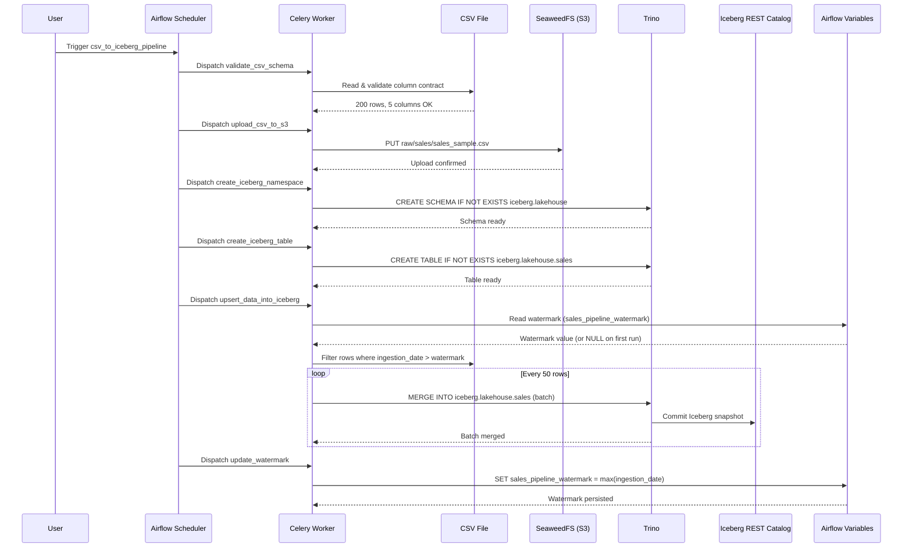

### Step-by-Step

**1. Unpause the DAG**

```bash
docker compose exec airflow-webserver airflow dags unpause csv_to_iceberg_pipeline
```

**2. Trigger a run**

```bash
docker compose exec airflow-webserver airflow dags trigger csv_to_iceberg_pipeline
```

**3. Monitor execution**

- **Airflow UI** at [http://localhost:8081](http://localhost:8081) (`admin` / `admin`) -- navigate to the DAG and click into the active run. The Graph view shows all six tasks in sequence.
- **Flower** at [http://localhost:5555](http://localhost:5555) -- the Tasks tab shows each task transitioning from `RECEIVED` -> `STARTED` -> `SUCCESS`.

### Verify Results

```bash
docker compose exec trino trino
```

```sql
-- Row count (should be 200 after first run)
SELECT COUNT(*) AS total_rows FROM iceberg.lakehouse.sales;

-- Sample data with audit columns
SELECT order_id, customer_id, amount, country,
       ingestion_date, _source_file, _ingested_at
FROM iceberg.lakehouse.sales
ORDER BY order_id
LIMIT 10;

-- Partition distribution
SELECT ingestion_date, COUNT(*) AS row_count
FROM iceberg.lakehouse.sales
GROUP BY ingestion_date
ORDER BY ingestion_date;
```

**Check the watermark** (should be `2024-02-09`, the max `ingestion_date` in the CSV):

```bash
docker compose exec airflow-webserver airflow variables get sales_pipeline_watermark
```

**Inspect Iceberg snapshots:**

```sql
SELECT snapshot_id, committed_at
FROM iceberg.lakehouse."sales$snapshots"
ORDER BY committed_at;
```

### Re-run Behaviour

| Scenario | What happens | Row count | Watermark |
|----------|--------------|-----------|-----------|
| **Re-run same CSV, no changes** | Watermark filters out all rows. Upsert is skipped. | 200 (unchanged) | Unchanged |
| **Change `amount` for existing `order_id`** (same date) | Row filtered by watermark -- change **not picked up** unless you reset the watermark. | 200 (unchanged) | Unchanged |
| **Change `amount` for existing `order_id`** (newer date) | `MERGE INTO` matches `order_id` -> `WHEN MATCHED` -> row updated. | 200 (unchanged) | Advances |
| **Add rows with new `order_id`s** (date > watermark) | `WHEN NOT MATCHED` -> rows inserted. | 200 + N | Advances |
| **Add rows with date <= watermark** | Filtered out. Reset watermark to force ingestion. | 200 (unchanged) | Unchanged |

**Reset the watermark** to force full reprocessing:

```bash
docker compose exec airflow-webserver airflow variables delete sales_pipeline_watermark
```

### MERGE INTO Logic

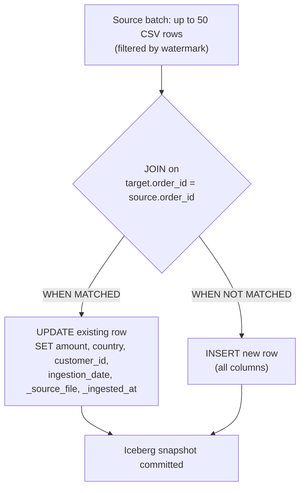

---

## 2. CSV Auto-Ingest (Automatic)

The `csv_auto_ingest` DAG eliminates manual table creation entirely. Drop a CSV into a folder inside `s3://csv-uploads/`, and the pipeline detects it, infers the schema, creates an Iceberg table, loads the data, and registers it in Superset -- all within a 5-minute polling cycle.

### How It Works

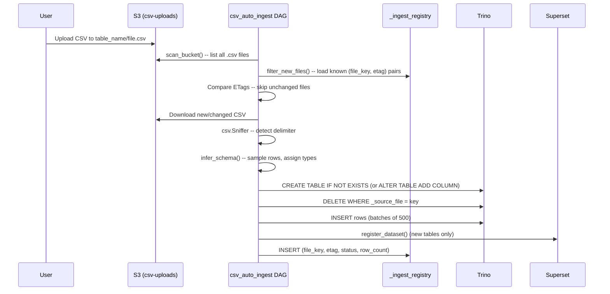

Key design choices:

- **Directory = table name.** `employees/data.csv` and `employees/q2.csv` both land in `iceberg.lakehouse.employees`.
- **Replace strategy.** Each file is tracked by `_source_file`. Re-ingestion deletes the old rows for that file, then inserts the new ones -- no duplicates, no full-table truncation.
- **Additive schema evolution.** New columns in a re-uploaded CSV trigger `ALTER TABLE ADD COLUMN`. Existing columns are never dropped or retyped.
- **Audit columns.** Every row gets `_source_file` (the S3 key) and `_ingested_at` (UTC timestamp).

### Step-by-Step Walkthrough

**1. Unpause the DAG**

```bash
docker compose exec airflow-webserver airflow dags unpause csv_auto_ingest
```

**2. Upload the test CSV**

The repository ships with a 10-row sample at `data/test/employees.csv`. Upload it into the `employees/` prefix:

```bash
AWS_ACCESS_KEY_ID=lakehouse_access_key \
AWS_SECRET_ACCESS_KEY=lakehouse_secret_key \
aws s3 cp data/test/employees.csv s3://csv-uploads/employees/data.csv \
  --endpoint-url http://localhost:8333 \
  --region us-east-1
```

**3. Wait for the DAG or trigger it manually**

The DAG polls every 5 minutes. To skip the wait:

```bash
docker compose exec airflow-webserver airflow dags trigger csv_auto_ingest
```

**4. Query the new table in Trino**

```bash
docker compose exec trino trino
```

```sql
SELECT * FROM iceberg.lakehouse.employees;
```

The inferred types for this file:

| Column | Inferred Type |
|--------|---------------|
| `id` | `INTEGER` |
| `name` | `VARCHAR` |
| `email` | `VARCHAR` |
| `age` | `INTEGER` |
| `salary` | `DOUBLE` |
| `signup_date` | `DATE` |
| `is_active` | `BOOLEAN` |

**5. Check the ingest registry**

```sql
SELECT file_key, etag, table_name, row_count, status, ingested_at
FROM iceberg.lakehouse._ingest_registry
WHERE table_name = 'employees';
```

### Schema Evolution

Schema evolution is **additive only**: the pipeline adds new columns but never removes or renames existing ones. Existing Parquet files return `NULL` for columns that didn't exist when they were written.

**Example:** Re-upload `employees/data.csv` with an extra `department` column:

```csv
id,name,email,age,salary,signup_date,is_active,department
1,Mario Rossi,mario@example.com,35,52000.50,2024-01-15,true,Engineering
2,Anna Bianchi,anna@example.com,28,45000.00,2024-02-20,true,Marketing
...
```

What happens:

1. ETag changed -> file marked for processing.
2. `infer_schema` finds 8 columns including `department VARCHAR`.
3. `ALTER TABLE iceberg.lakehouse.employees ADD COLUMN department VARCHAR` is executed.
4. Old 10 rows for `_source_file = 'employees/data.csv'` are deleted.
5. New 10 rows (with `department` populated) are inserted.
6. Rows from other files in the same table are unaffected -- their `department` column returns `NULL`.

### Multiple Files, Same Table

All CSVs within the same directory prefix share a single Iceberg table:

```
s3://csv-uploads/employees/
  us_office.csv    (500 rows)
  eu_office.csv    (300 rows)
```

Both land in `iceberg.lakehouse.employees` (800 rows total). Re-uploading `us_office.csv` replaces only its 500 rows; the 300 `eu_office.csv` rows are unaffected.

```sql
SELECT _source_file, COUNT(*) AS row_count
FROM iceberg.lakehouse.employees
GROUP BY _source_file;
```

### ETag-Based Deduplication

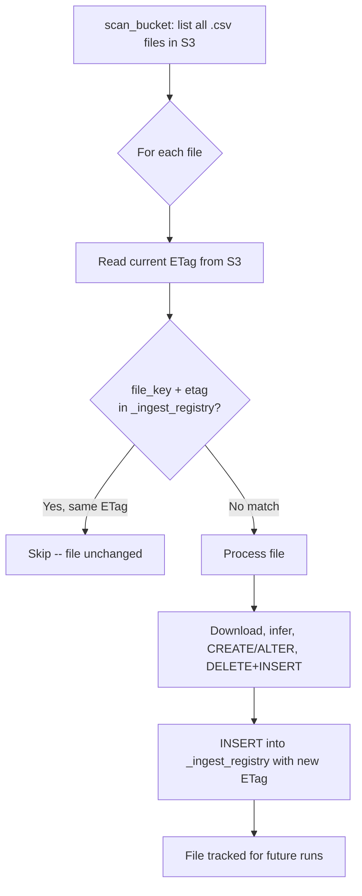

Failed files are recorded with `status = 'failed'`, so they are re-attempted on the next DAG run.

### What Happens When...

| Scenario | Behaviour |
|----------|-----------|
| **Upload a new file** | Table created (if first file in directory), rows inserted, Superset dataset registered, registry entry added. |
| **Re-upload same file unchanged** | ETag matches -- file skipped entirely. No queries hit Trino. |
| **Re-upload file with changed data** | ETag differs -- old rows for that `_source_file` deleted, new rows inserted, registry updated. |
| **Upload file with new columns** | `ALTER TABLE ADD COLUMN` runs. Existing rows get `NULL` for new columns. |
| **Delete file from S3** | Nothing happens automatically. Rows remain in Iceberg. Clean up manually: `DELETE FROM table WHERE _source_file = 'key'`. |

---

## 3. Data Quality Checks

The `data_quality_checks` DAG validates data integrity on the `sales` table after ingestion. It runs eight pre-configured checks, persists results to an Iceberg table, and enforces a quality gate that fails the pipeline if any check does not pass.

### Pipeline Flow

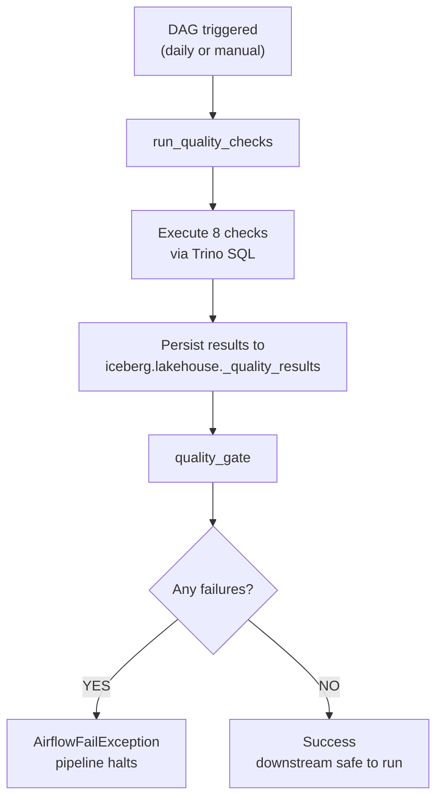

### Trigger the DAG

```bash
# Unpause
docker compose exec airflow-webserver airflow dags unpause data_quality_checks

# Manual trigger
docker compose exec airflow-webserver airflow dags trigger data_quality_checks
```

### Query Results in Trino

```sql
SELECT check_name, check_type, status, details, executed_at
FROM iceberg.lakehouse._quality_results
ORDER BY executed_at DESC;
```

`status` is either `PASS` or `FAIL`. The `details` column contains the diagnostic message.

### Pre-Configured Checks

| # | Check Name | Type | Validates | Fails When |
|---|-----------|------|-----------|------------|
| 1 | `order_id_unique` | `uniqueness` | `order_id` has no duplicates | Any duplicate `order_id` |
| 2 | `order_id_not_null` | `not_null` | `order_id` is never NULL | Any NULL `order_id` |
| 3 | `customer_id_not_null` | `not_null` | `customer_id` is never NULL | Any NULL `customer_id` |
| 4 | `amount_positive` | `positive` | `amount` > 0 | Any `amount` <= 0 |
| 5 | `amount_range` | `range` | `amount` between 0 and 100,000 | `amount` outside range |
| 6 | `country_accepted` | `accepted_values` | `country` in allowed set | Unknown country value |
| 7 | `no_future_ingestion` | `no_future_dates` | `ingestion_date` <= today | Future date found |
| 8 | `row_count_valid` | `row_count_range` | 1 to 1,000,000 rows | Count is 0 or exceeds limit |

### Adding a Custom Check

Define a new `QualityCheck` in `airflow/dags/data_quality_checks.py`:

```python
from lib.quality_checks import QualityCheck

custom_check = QualityCheck(
    name="discount_not_negative",
    check_type="custom_sql",
    table="iceberg.lakehouse.sales",
    custom_sql="""
        SELECT COUNT(*) AS failures
        FROM iceberg.lakehouse.sales
        WHERE discount < 0
    """,
    description="Discount must not be negative",
)

checks.append(custom_check)
```

The `custom_sql` type expects a query returning a single column `failures` -- any value > 0 triggers a failure.

### Gate Logic

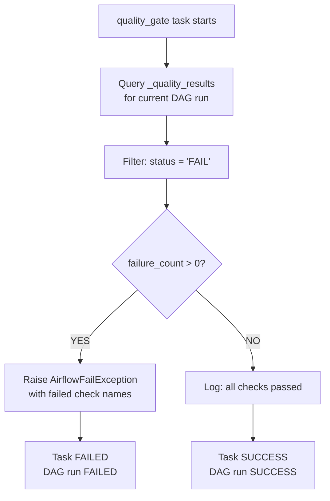

The gate is intentionally strict -- a single failing check halts the entire DAG run. Downstream consumers should never operate on data that has not passed all quality assertions.

---

## 4. Querying Data via Trino

Trino provides the SQL query layer over Iceberg tables. It reads table metadata from the Iceberg REST Catalog and fetches Parquet data files from SeaweedFS.

### Query Flow

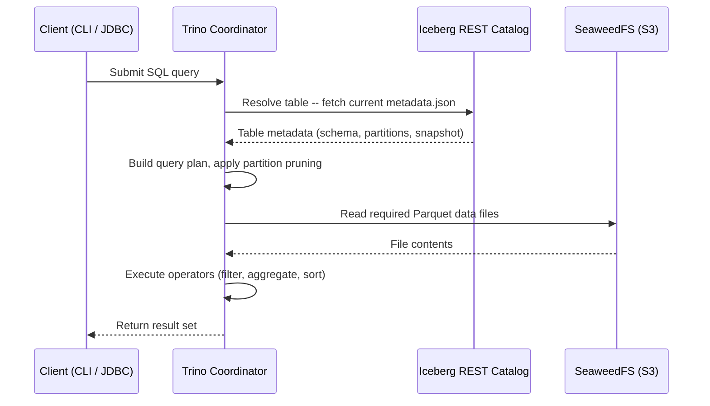

### Connecting

```bash
docker compose exec trino trino
```

You can also point any JDBC/ODBC client at `http://localhost:8083` -- no authentication required.

### Discovery

```sql
SHOW SCHEMAS FROM iceberg;
SHOW TABLES FROM iceberg.lakehouse;
DESCRIBE iceberg.lakehouse.sales;
```

### Business Queries

```sql
-- Row count
SELECT COUNT(*) AS total_rows FROM iceberg.lakehouse.sales;

-- Revenue by country
SELECT country, COUNT(*) AS order_count, SUM(amount) AS total_revenue,
       AVG(amount) AS avg_order_value
FROM iceberg.lakehouse.sales
GROUP BY country
ORDER BY total_revenue DESC;

-- Top customers by spend
SELECT customer_id, COUNT(*) AS orders, SUM(amount) AS lifetime_value
FROM iceberg.lakehouse.sales
GROUP BY customer_id
ORDER BY lifetime_value DESC
LIMIT 20;

-- Daily order trends
SELECT ingestion_date, COUNT(*) AS orders, SUM(amount) AS daily_revenue
FROM iceberg.lakehouse.sales
GROUP BY ingestion_date
ORDER BY ingestion_date;

-- Data freshness
SELECT MAX(_ingested_at) AS latest_ingestion,
       COUNT(DISTINCT _source_file) AS source_files
FROM iceberg.lakehouse.sales;

-- Revenue distribution
SELECT country, approx_percentile(amount, 0.50) AS p50,
       approx_percentile(amount, 0.95) AS p95
FROM iceberg.lakehouse.sales
GROUP BY country
ORDER BY country;
```

### Iceberg-Specific Queries

**Snapshot history:**

```sql
SELECT snapshot_id, parent_id, operation, committed_at
FROM iceberg.lakehouse."sales$snapshots"
ORDER BY committed_at DESC;
```

**Time travel** (substitute a `snapshot_id` from above):

```sql
SELECT * FROM iceberg.lakehouse.sales FOR VERSION AS OF <snapshot_id> LIMIT 100;

-- Compare row counts across snapshots
SELECT 'current' AS version, COUNT(*) AS rows FROM iceberg.lakehouse.sales
UNION ALL
SELECT 'previous', COUNT(*) FROM iceberg.lakehouse.sales FOR VERSION AS OF <snapshot_id>;
```

**Partition information:**

```sql
SELECT * FROM iceberg.lakehouse."sales$partitions";
```

**File-level metadata:**

```sql
SELECT file_path, file_format, record_count, file_size_in_bytes
FROM iceberg.lakehouse."sales$files"
ORDER BY file_size_in_bytes DESC;
```

### Metadata Tables

```sql
-- Ingest registry (auto-ingest tracking)
SELECT * FROM iceberg.lakehouse._ingest_registry ORDER BY ingested_at DESC LIMIT 20;

-- Quality check results
SELECT * FROM iceberg.lakehouse._quality_results ORDER BY executed_at DESC LIMIT 20;

-- Maintenance operations log
SELECT * FROM iceberg.lakehouse._maintenance_log ORDER BY executed_at DESC LIMIT 20;
```

---

## 5. Superset Dashboards

### Auto-Provisioning

On first boot, the Superset container runs `superset/bootstrap.sh`, which blocks until Trino is healthy, then registers a Trino database connection named **Trino Lakehouse** pointing at `trino://trino@trino:8080/iceberg/lakehouse`. The script then invokes `superset/provision_dashboard.py`, which creates a dataset, builds eight charts, and assembles them into the **Sales Lakehouse Dashboard**. The entire sequence is idempotent.

### Auto-Provisioning Flow

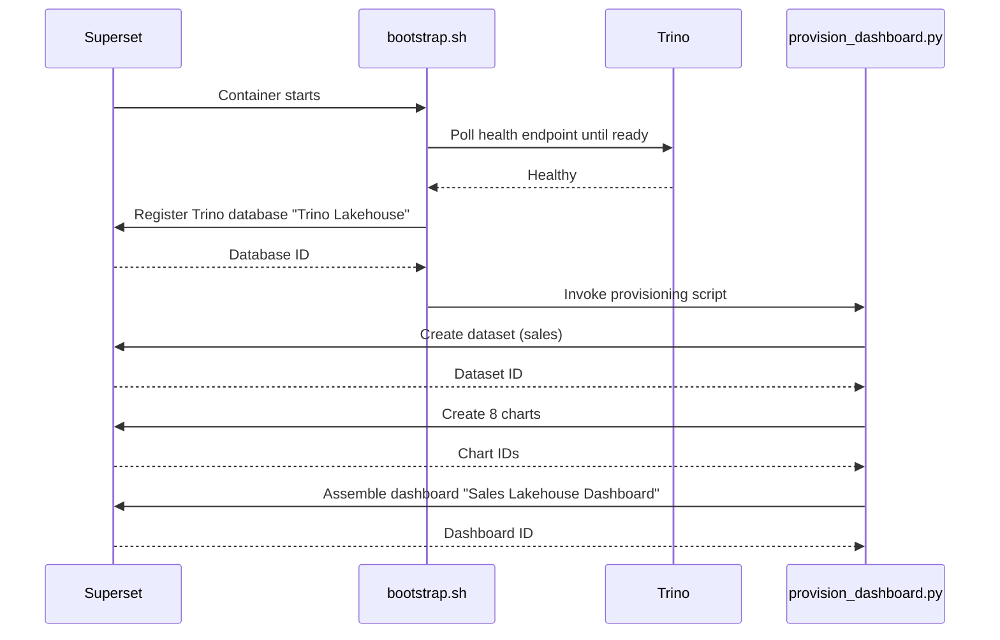

### Accessing the Dashboard

1. Open [http://localhost:8088](http://localhost:8088) and log in with `admin` / `admin`.
2. Navigate to **Dashboards** in the top menu.
3. Click **Sales Lakehouse Dashboard**.

All charts render live against Trino. Charts only display data after a DAG has completed at least one run.

### Pre-Built Charts

| # | Chart | Type | Description |
|---|-------|------|-------------|
| 1 | Total Revenue | Big Number | Sum of all order amounts |
| 2 | Total Orders | Big Number | Total order count |
| 3 | Average Order Value | Big Number | Mean revenue per order |
| 4 | Revenue by Country | Bar | Revenue by country, sorted descending |
| 5 | Orders by Country | Pie | Order distribution across countries |
| 6 | Daily Revenue Trend | Line | Revenue aggregated by day |
| 7 | Daily Orders Trend | Line | Order count by day |
| 8 | Top 10 Customers | Table | Customers ranked by total spend |

### Creating a Custom Chart

1. Open **SQL Lab -> SQL Editor** from the top navigation.
2. Select **Trino Lakehouse** database and `lakehouse` schema.
3. Write and run your query.
4. Click **Create Chart** -> choose a visualization type -> configure -> **Save**.

### Auto-Ingest Dataset Registration

When the `csv_auto_ingest` DAG creates a new Iceberg table, it also registers it as a Superset dataset via the REST API. The table is immediately available for charting -- no manual step required.

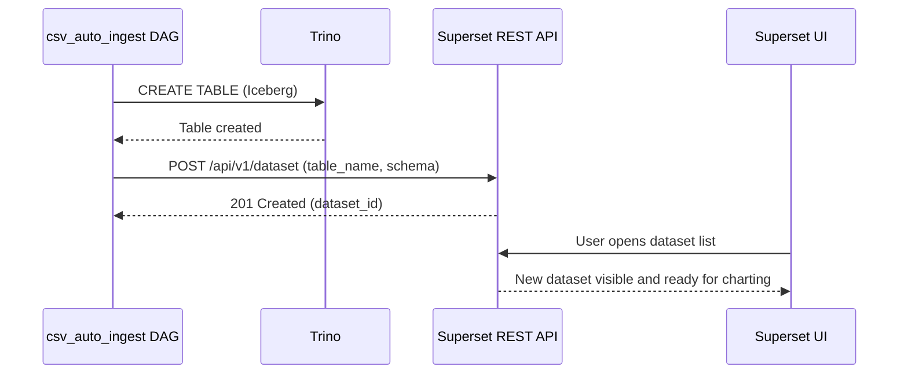

---

## 6. Monitoring & Observability

The platform ships with a fully wired Prometheus + Grafana stack. Every service exposes metrics that are scraped, stored, and visualized automatically.

### Metrics Architecture

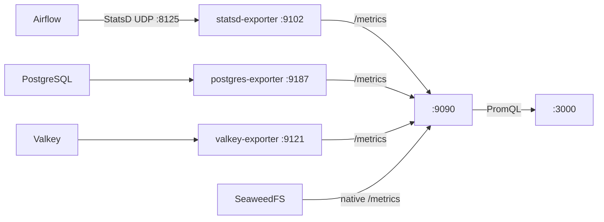

Airflow emits StatsD datagrams over UDP to port 8125, where `statsd-exporter` translates them into Prometheus-scrapeable metrics on `:9102`. PostgreSQL and Valkey use the sidecar-exporter pattern. SeaweedFS exposes `/metrics` natively.

### Accessing Grafana

1. Open [http://localhost:3000](http://localhost:3000) and log in with `admin` / `admin`.
2. The Prometheus datasource is auto-provisioned.
3. Navigate to **Dashboards -> Browse** and open **Lakehouse Platform Overview**.

### Dashboard Panels

| Row | Panel | Type | What It Shows |
|-----|-------|------|---------------|
| **Platform Health** | Services Up | Stat | Count of scrape targets in `up` state |
| | Airflow Task Success Rate | Stat | Task success percentage (last hour) |
| | PostgreSQL Active Connections | Stat | Current active connections |
| | Valkey Memory Usage | Stat | Resident memory consumed by Valkey |
| **Airflow** | Task Duration | Timeseries | P50/P95 task execution duration by DAG |
| | Scheduler Heartbeat | Timeseries | Scheduler heartbeat interval |
| **DB & Broker** | PostgreSQL Cache Hit Ratio | Timeseries | Buffer cache hit ratio |
| | Valkey Commands/sec | Timeseries | Command throughput |
| **Storage** | SeaweedFS Volume Size | Timeseries | Total bytes stored |
| | S3 Request Rate | Timeseries | S3 API request rate (GET, PUT, DELETE) |

### Alert Rules

| Alert Name | Condition | Severity |
|------------|-----------|----------|
| `ServiceDown` | Any scrape target `up == 0` for > 1 min | **critical** |
| `AirflowTaskFailureHigh` | Task failure rate > 10% over 5 min | **warning** |
| `SeaweedFSDiskUsageHigh` | Volume disk utilization > 85% | **warning** |
| `ValkeyMemoryHigh` | Memory usage > 80% of maxmemory | **warning** |
| `PostgresConnectionsHigh` | Active connections > 80% of max | **critical** |

### Verifying Scrape Targets

Open [http://localhost:9090/targets](http://localhost:9090/targets) to confirm all targets report `UP`.

### Airflow Metrics Flow

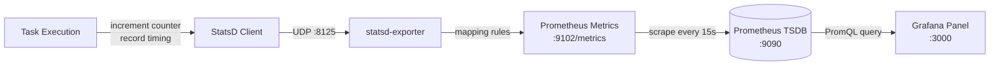

Airflow's built-in StatsD integration emits counters (`ti_successes`, `ti_failures`), timers (`dag.*.*.duration`), and gauges (`scheduler.heartbeat`) automatically -- no DAG code changes required.

---

## 7. Troubleshooting

### Debugging Flowchart

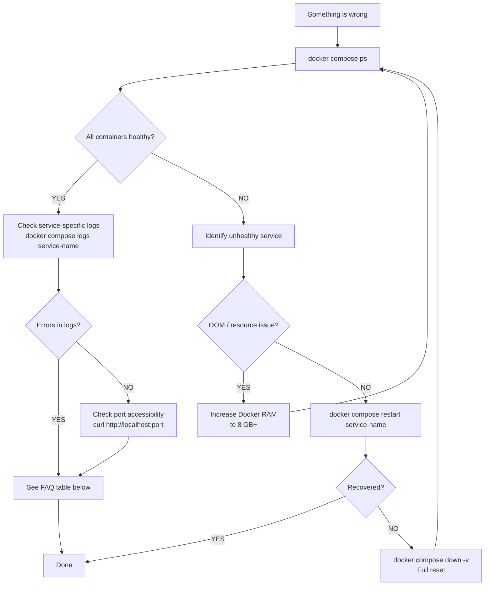

### Common Issues

| # | Symptom | Likely Cause | Resolution |
|---|---------|-------------|------------|
| 1 | **Containers keep restarting** | Docker doesn't have enough RAM. Stack needs ~6 GB at rest, 8 GB+ under load. | Allocate at least 8 GB to Docker Desktop. Verify with `docker stats --no-stream`. |
| 2 | **DAGs don't appear in Airflow UI** | Scheduler needs ~2 minutes to parse DAGs on first boot. DAGs are also paused by default. | Wait 2 minutes. Check for syntax errors: `docker compose logs airflow-scheduler \| grep -i error`. |
| 3 | **Trino: "table not found"** | Tables are created by the DAGs, not at startup. The DAG hasn't run yet. | Run the relevant DAG. Verify: `SHOW TABLES FROM iceberg.lakehouse` in Trino CLI. |
| 4 | **SeaweedFS buckets not created** | `s3-init` ran before SeaweedFS was ready. | Restart: `docker compose restart s3-init`. Verify: `aws --endpoint-url http://localhost:8333 s3 ls`. |
| 5 | **Superset shows no data** | DAG hasn't completed yet, or Trino connection is misconfigured. | Check DAG status in Airflow. In Superset, test the Trino connection under Settings -> Database Connections. |
| 6 | **Auto-ingest doesn't pick up my file** | File not in a subdirectory, DAG paused, or ETag already processed. | Files must be at `s3://csv-uploads/<table_name>/file.csv` (not root). Unpause DAG. Check `_ingest_registry`. |
| 7 | **MERGE INTO fails** | Trino requires literal VALUES in the source CTE (no parameterized queries). | Ensure literal value interpolation. Reduce `MERGE_BATCH_SIZE` if queries time out. Call `cursor.fetchone()` after every DML. |
| 8 | **Grafana dashboards empty** | Prometheus targets are down. | Check [http://localhost:9090/targets](http://localhost:9090/targets). Restart failing exporters. |
| 9 | **Worker tasks stuck in "queued"** | Worker can't reach Valkey broker. | Check Flower at [http://localhost:5555](http://localhost:5555). Verify Valkey: `docker compose exec valkey valkey-cli ping` (should return `PONG`). |
| 10 | **Port conflict on startup** | Another process is using the port. | Identify: `lsof -i :<port>`. Stop the conflicting process or override ports via `.env`. |

### Trino-Specific Gotchas

- **Always call `cursor.fetchone()` after DDL/DML.** Without it, statements are never materialised.
- **Parameterized queries pass all values as VARCHAR.** Use `CAST(? AS INTEGER)`, `CAST(? AS DOUBLE)`, etc.
- **MERGE INTO does not support parameterized source rows.** The source CTE must use literal `VALUES(...)`.

### Useful Diagnostic Commands

```bash
# Stack health
docker compose ps
docker stats --no-stream
docker compose logs -f --tail=100 <service>

# Airflow
docker compose exec airflow-webserver airflow dags list
docker compose exec airflow-webserver airflow dags list-import-errors

# Trino
docker compose exec trino trino
docker compose exec trino trino --execute "SHOW SCHEMAS FROM iceberg"

# SeaweedFS / S3
AWS_ACCESS_KEY_ID=lakehouse_access_key \
AWS_SECRET_ACCESS_KEY=lakehouse_secret_key \
aws --endpoint-url http://localhost:8333 s3 ls

# Valkey
docker compose exec valkey valkey-cli ping

# Prometheus targets
curl -s http://localhost:9090/api/v1/targets | python3 -m json.tool
```

### Full Stack Reset

Destroys all data -- Iceberg tables, Airflow metadata, Superset dashboards, Prometheus history.

```bash
# Stop and remove volumes
docker compose down -v

# Start clean
docker compose up -d

# Wait for s3-init (~15-20s), then unpause DAGs
docker compose exec airflow-webserver airflow dags unpause csv_to_iceberg_pipeline
docker compose exec airflow-webserver airflow dags unpause csv_auto_ingest
```
