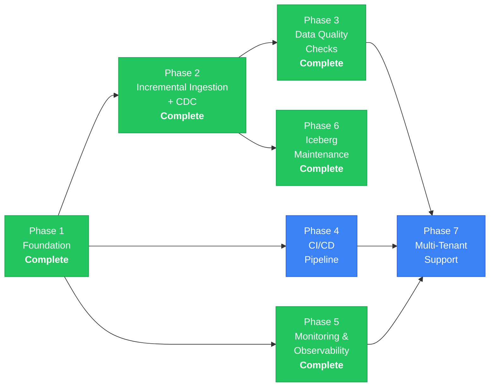

# Project Roadmap

> A phased plan for evolving the lakehouse-orchestrator from a functional
> reference architecture into a production-hardened, observable, multi-tenant
> data platform.

---

## Phase 1: Foundation (Current)

### Description

Establish the core lakehouse architecture with all essential services running as
Docker containers on a single machine. This phase delivers the end-to-end data
path: CSV ingestion through Airflow, Parquet storage on SeaweedFS, Iceberg table
registration via Trino, and interactive dashboards in Superset.

### Deliverables

- Docker Compose deployment with all services (PostgreSQL, Valkey, SeaweedFS,
  Airflow with CeleryExecutor, Trino, Superset).
- Custom Airflow Docker image with `boto3`, `pyarrow`, `pandas`, `trino`, and
  Celery provider dependencies.
- Custom Superset Docker image with `sqlalchemy-trino` and auto-provisioning
  bootstrap script.
- SeaweedFS S3 configuration with bucket auto-creation (`lakehouse`,
  `lakehouse-warehouse`).
- Trino Iceberg catalog configuration with REST catalog and S3 storage backend.
- PostgreSQL initialisation script for Superset metadata database.
- Sample sales dataset (`data/raw/sales_sample.csv`) with 20 records across 7
  countries.
- Environment configuration template (`.env.example`) with all service
  credentials.
- OpenSpec documentation suite (architecture, specs, roadmap).

### Acceptance Criteria

- [ ] `docker compose up -d` starts all services without errors.
- [ ] All health checks pass within 120 seconds.
- [ ] Airflow webserver is accessible at `http://localhost:8081`.
- [ ] Flower is accessible at `http://localhost:5555` and shows one registered
      worker.
- [ ] Trino is accessible at `http://localhost:8083` and the `iceberg` catalog
      is listed.
- [ ] Superset is accessible at `http://localhost:8088` with the Trino
      datasource pre-registered.
- [ ] `aws s3 ls --endpoint-url http://localhost:8333` returns the `lakehouse`
      and `lakehouse-warehouse` buckets.

---

## Phase 2: Incremental Ingestion and Change Data Capture — Complete

### Description

Extend the ingestion pipeline to support incremental loads and change data
capture (CDC). The pipeline now handles automated CSV ingestion with S3 event
detection and supports MERGE INTO upsert semantics with watermark-based
incremental extraction. New or modified records are applied as deltas to the
Iceberg table, reducing processing time, storage waste, and Trino query
overhead.

### Deliverables

- Airflow DAG for automated CSV ingestion with S3 file-change detection
  (`sales_pipeline`).
- MERGE INTO upsert support via `order_id` as merge key.
- Watermark-based incremental extraction using Airflow Variables.
- Audit columns (`_source_file`, `_ingested_at`) on the sales table.
- Deduplication logic based on `order_id` as the primary key.
- Optional: Debezium CDC connector for capturing changes from an upstream
  transactional database.

### Acceptance Criteria

- [ ] Running the incremental DAG twice with the same file produces no
      duplicate records.
- [ ] Running the incremental DAG with an updated file (changed `amount` for an
      existing `order_id`) updates the record in-place via MERGE INTO.
- [ ] The `_ingested_at` timestamp reflects the time of the most recent
      ingestion, not the original load time.
- [ ] Watermark state persists across DAG runs (stored in Airflow Variables or
      an external state store).

---

## Phase 3: Data Quality Checks — Complete

### Description

Automated data quality validation integrated into the ingestion pipeline via a
custom validation framework. Quality checks run after ingestion and before the
data is promoted to the "trusted" layer. Failed checks halt downstream
processing and generate alerts.

### Deliverables

- Custom validation framework (`lib/quality_checks.py`) with 8 check types:
  uniqueness, not_null, positive, range, accepted_values, no_future_dates,
  row_count_range, and custom SQL.
- `data_quality_checks` DAG with run → persist + gate pattern.
- `_quality_results` Iceberg metadata table for historical analysis.
- 8 checks for the `sales` table:
  - `order_id` uniqueness.
  - `order_id` not null.
  - `amount` is positive.
  - `amount` is within a reasonable range.
  - `country` values belong to a known reference set (accepted_values).
  - `ingestion_date` is not in the future (no_future_dates).
  - Row count is within expected bounds (row_count_range).
- Airflow task group that runs quality checks as a gate between ingestion and
  table promotion.
- Quality check results persisted to the `_quality_results` metadata table.
- Alerting on quality check failures (Airflow email/Slack callback).

### Acceptance Criteria

- [ ] A CSV with a negative `amount` triggers a quality check failure.
- [ ] A CSV with a duplicate `order_id` triggers a quality check failure.
- [ ] Quality check results are queryable through Trino (stored in an Iceberg
      metadata table).
- [ ] Failed quality checks prevent the data from being promoted to the trusted
      layer.
- [ ] Quality check history is visible in the Airflow UI as a separate task
      group.

---

## Phase 4: CI/CD Pipeline

### Description

Automate testing, linting, and deployment validation with a GitHub Actions
pipeline. Every pull request runs automated checks to prevent regressions. The
main branch is always deployable.

### Deliverables

- GitHub Actions workflow for pull requests:
  - Python linting (ruff or flake8) for DAG source code.
  - DAG import validation (`python -c "import dags.<dag_name>"`).
  - Docker Compose build validation (`docker compose build`).
  - Integration test: spin up the full stack, run the ingestion DAG, verify
    data appears in Trino.
- GitHub Actions workflow for main branch:
  - Full integration test suite.
  - Docker image build and push to GitHub Container Registry (GHCR).
- Pre-commit hooks for local development (ruff, trailing whitespace, YAML
  validation).

### Acceptance Criteria

- [ ] A pull request with a syntax error in a DAG file fails the CI check.
- [ ] A pull request that breaks `docker compose build` fails the CI check.
- [ ] The integration test validates end-to-end data flow (CSV to Trino query
      result).
- [ ] Docker images are tagged with the git SHA and pushed to GHCR on merge to
      main.
- [ ] CI runs complete within 10 minutes.

---

## Phase 5: Monitoring and Observability — Complete

### Description

Comprehensive monitoring and observability for the platform using Prometheus for
metrics collection and Grafana for dashboards and alerting. Prometheus scrapes
metrics from all services via dedicated exporters: Airflow metrics flow through a
StatsD Exporter, PostgreSQL metrics via postgres_exporter, and Valkey metrics via
a Valkey Exporter. SeaweedFS exposes native Prometheus metrics. Grafana is
auto-provisioned with a "Lakehouse Platform Overview" dashboard containing 10
panels and 5 alerting rules.

### Deliverables

- Prometheus deployment with scrape targets for all services.
- StatsD Exporter for Airflow CeleryExecutor metrics.
- PostgreSQL Exporter for database connection and query metrics.
- Valkey Exporter for memory, client, and command metrics.
- Grafana deployment with auto-provisioned "Lakehouse Platform Overview"
  dashboard (10 panels covering Airflow, PostgreSQL, Valkey, and SeaweedFS).
- 5 alerting rules:
  - Airflow task failure rate exceeds threshold.
  - PostgreSQL connection count exceeds 80% of max.
  - PostgreSQL cache hit ratio drops below 95%.
  - Valkey memory usage exceeds 80%.
  - SeaweedFS volume server down.
- Datasource and dashboard provisioning via Grafana provisioning API
  (YAML + JSON, zero manual setup).

### Acceptance Criteria

- [x] Prometheus scrapes metrics from all services without errors.
- [x] Grafana dashboard displays real-time metrics for Airflow, PostgreSQL,
      Valkey, and SeaweedFS.
- [x] 5 alerting rules are configured and evaluate correctly.
- [x] All metrics are retained for at least 7 days.
- [x] Grafana is accessible at `http://localhost:3000`.
- [x] Dashboard and datasource are auto-provisioned on first boot.

---

## Phase 6: Iceberg Maintenance — Complete

### Description

Automated Iceberg table maintenance via the `iceberg_maintenance` DAG. The DAG
runs daily at 3 AM UTC and dynamically discovers all tables in the
`iceberg.lakehouse` schema using Trino's `information_schema`. For each table,
it executes three maintenance operations: file compaction (`optimize`), snapshot
expiry (7-day retention via `expire_snapshots`), and orphan file cleanup
(`remove_orphan_files`). Dynamic task mapping ensures newly created tables are
maintained automatically without DAG changes. All maintenance results are tracked
in the `_maintenance_log` Iceberg table for historical analysis.

### Deliverables

- `iceberg_maintenance` Airflow DAG with daily schedule (3 AM UTC).
- Three maintenance operations per table:
  - **Compaction** (`optimize`): merge small Parquet files into larger files to
    reduce metadata overhead and improve scan performance.
  - **Snapshot expiry** (`expire_snapshots`): remove snapshots older than 7 days
    to free storage.
  - **Orphan file cleanup** (`remove_orphan_files`): identify and delete data
    files not referenced by any current snapshot.
- Dynamic task mapping via `expand()` — automatically discovers and maintains
  all tables in the schema.
- `_maintenance_log` Iceberg tracking table with operation type, table name,
  status, duration, and error details.
- Maintenance library (`lib/iceberg_maintenance.py`) with reusable functions.

### Acceptance Criteria

- [x] Compaction reduces the number of Parquet files per partition when the
      file count exceeds the configured threshold.
- [x] Snapshot expiry removes snapshots older than the retention period.
- [x] Orphan file cleanup reclaims storage for unreferenced files.
- [x] Maintenance DAG runs on a daily schedule without manual intervention.
- [x] Dynamic task mapping discovers and maintains all tables automatically.
- [x] Maintenance run history is queryable through Trino via `_maintenance_log`.

---

## Phase 7: Multi-Tenant Support

### Description

Evolve the platform to support multiple tenants, each with isolated data,
schemas, and access controls. This enables the platform to serve multiple teams
or business units from a single deployment.

### Deliverables

- Tenant isolation model:
  - Each tenant gets a dedicated Iceberg schema (e.g., `iceberg.tenant_a`,
    `iceberg.tenant_b`).
  - Each tenant gets a dedicated S3 prefix or bucket.
  - Trino access controls enforce schema-level isolation.
- Tenant provisioning automation:
  - Airflow DAG or script to create a new tenant (schema, bucket, credentials,
    Superset workspace).
- Superset row-level security (RLS) or workspace isolation per tenant.
- SeaweedFS IAM policies scoped per tenant.
- Trino system access control plugin for fine-grained authorization.
- Tenant usage metering (storage consumed, queries executed, DAG runs).

### Acceptance Criteria

- [ ] A new tenant can be provisioned by running a single command or DAG.
- [ ] Tenant A cannot query or access Tenant B's data through Trino.
- [ ] Tenant A cannot access Tenant B's S3 objects.
- [ ] Superset dashboards are scoped to the authenticated tenant's data.
- [ ] Tenant usage metrics are queryable for billing or capacity planning.
- [ ] Deleting a tenant removes all associated schemas, data, and credentials.

---

## Timeline Summary

| Phase | Status | Dependencies |
|-------|--------|-------------|
| Phase 1: Foundation | **Complete** | None |
| Phase 2: Incremental Ingestion + CDC | **Complete** | Phase 1 |
| Phase 3: Data Quality Checks | **Complete** | Phase 2 |
| Phase 4: CI/CD Pipeline | Planned | Phase 1 |
| Phase 5: Monitoring & Observability | **Complete** | Phase 1 |
| Phase 6: Iceberg Maintenance | **Complete** | Phase 2 |
| Phase 7: Multi-Tenant Support | Planned | Phases 3, 4, 5 |

Phases 4 and 5 can be pursued in parallel with Phases 2 and 3, as they address
orthogonal concerns (developer workflow and operational visibility).
