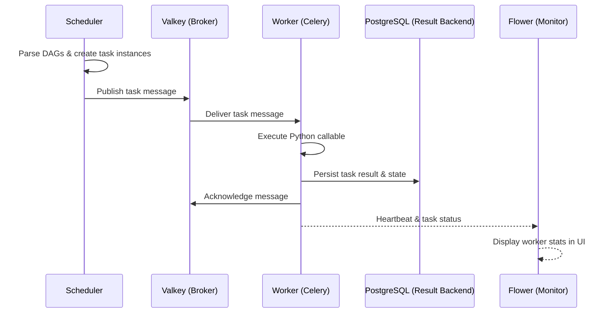
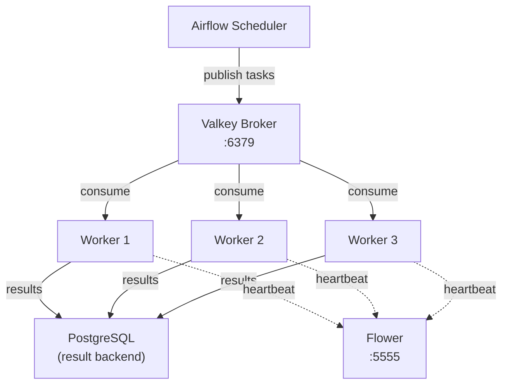

# Spec: Celery Execution Model

---

## Goal

Configure Apache Airflow to use the CeleryExecutor backed by Valkey as the
message broker, enabling distributed task execution across one or more worker
containers with support for horizontal scaling, task monitoring, and reliable
message delivery.

---

## Context

Airflow supports multiple executor backends. The CeleryExecutor is the
standard choice for production deployments where tasks must run outside the
scheduler process. In this architecture, the Airflow scheduler serialises task
instances as messages and publishes them to a Valkey broker. Worker containers
consume these messages and execute the corresponding Python callables.

This separation of concerns allows the scheduler, webserver, and workers to
scale independently and fail independently without cascading failures.

### Task Execution Flow



### Components Involved

| Component | Container | Role |
|-----------|-----------|------|
| Scheduler | `lakehouse-airflow-scheduler` | Parses DAGs, creates task instances, publishes messages to the broker |
| Worker | `lakehouse-airflow-worker` | Consumes task messages from the broker, executes task callables |
| Flower | `lakehouse-airflow-flower` | Web-based monitoring UI for Celery workers, queues, and task states |
| Valkey | `lakehouse-valkey` | Message broker (Redis-wire-protocol compatible) |
| PostgreSQL | `lakehouse-postgres` | Celery result backend (task state persistence) |

---

## Requirements

### Functional Requirements

| ID | Requirement |
|----|-------------|
| FR-1 | Airflow must be configured with `AIRFLOW__CORE__EXECUTOR=CeleryExecutor`. |
| FR-2 | The Celery broker URL must point to Valkey at `redis://valkey:6379/0`. |
| FR-3 | The Celery result backend must use PostgreSQL at `db+postgresql://<user>:<pass>@postgres:5432/<db>`. |
| FR-4 | At least one Celery worker must be running and registered with the broker before DAGs can execute. |
| FR-5 | Flower must be accessible on port 5555 for real-time worker and task monitoring. |
| FR-6 | Workers must gracefully shut down when receiving SIGTERM, completing in-flight tasks before exiting. |

### Non-Functional Requirements

| ID | Requirement |
|----|-------------|
| NFR-1 | Worker health checks must detect and report unhealthy workers within 60 seconds. |
| NFR-2 | Broker connection failures must not crash the scheduler; the scheduler must retry connectivity. |
| NFR-3 | Task messages must survive broker restarts (Valkey persistence). |

---

## Why CeleryExecutor over LocalExecutor

| Criterion | LocalExecutor | CeleryExecutor |
|-----------|---------------|----------------|
| **Execution model** | Tasks run as subprocesses on the scheduler host | Tasks run on dedicated worker containers |
| **Horizontal scaling** | Cannot scale beyond a single machine | Add workers with `docker compose up --scale airflow-worker=N` |
| **Fault isolation** | A task that exhausts memory or CPU impacts the scheduler | Worker failures do not affect the scheduler or webserver |
| **Monitoring** | Limited to Airflow UI task logs | Flower provides real-time worker stats, active task lists, and queue depths |
| **Resource contention** | Scheduler and tasks compete for the same CPU and memory | Workers have dedicated resources; scheduler remains responsive |
| **Production readiness** | Suitable for development and light workloads | Recommended for production deployments by the Airflow documentation |

**Decision**: The CeleryExecutor is chosen because the lakehouse-orchestrator is
designed as a production-grade reference architecture. Even with a single worker
in the default configuration, the architecture is ready to scale horizontally
without any configuration changes beyond increasing the replica count.

---

## Valkey as Broker

### Configuration

```
AIRFLOW__CELERY__BROKER_URL=redis://valkey:6379/0
```

Valkey implements the Redis wire protocol. Airflow's Celery integration uses the
`redis://` URI scheme, and no code changes are required to use Valkey as a
drop-in replacement.

### Broker Responsibilities

1. **Message queue**: receives serialised task instances from the scheduler and
   holds them until a worker is available.
2. **Task routing**: delivers messages to the appropriate queue based on the
   task's queue assignment (default queue: `default`).
3. **Heartbeat**: workers send periodic heartbeats through the broker to signal
   liveness to Flower and the scheduler.

### Persistence

Valkey is configured with the `valkey-data` Docker volume mounted at `/data`.
By default, Valkey uses RDB snapshotting for persistence. This means that
in-flight task messages survive clean container restarts. In the event of an
unclean shutdown, at most a few seconds of unacknowledged messages may be lost;
Airflow's scheduler will detect orphaned task instances and re-queue them.

### Health Check

```yaml
healthcheck:
  test: ["CMD", "valkey-cli", "ping"]
  interval: 10s
  timeout: 5s
  retries: 5
```

The scheduler and worker containers have a `depends_on` condition requiring
Valkey to be healthy before starting.

---

## Worker Scaling Model

### Default Configuration

The default deployment includes a single Celery worker
(`lakehouse-airflow-worker`). This is sufficient for development and
single-pipeline workloads.

### Horizontal Scaling



```bash
docker compose up --scale airflow-worker=3 -d
```

Each additional worker container:

- Connects to the same Valkey broker
- Consumes from the same task queue
- Reports to the same PostgreSQL result backend
- Appears in Flower as a distinct worker node

### Scaling Considerations

| Factor | Guidance |
|--------|----------|
| **CPU-bound tasks** | Scale workers to match available CPU cores. Each worker defaults to `--concurrency` equal to the number of CPUs in the container. |
| **I/O-bound tasks** | Increase concurrency per worker rather than adding workers. S3 uploads and Trino queries are I/O-bound. |
| **Memory** | Each worker loads the full DAG bag into memory. Monitor per-worker memory usage when increasing replica count. |
| **Broker throughput** | A single Valkey instance handles thousands of messages per second. Broker scaling is not a concern at typical lakehouse workloads. |

---

## Task Routing and Concurrency

### Default Queue

All tasks are routed to the `default` Celery queue unless explicitly overridden
in the DAG definition. This simplifies initial deployment and avoids
misconfiguration.

### Custom Queue Example

For future workloads that require isolation (e.g., heavy computation vs.
lightweight API calls), tasks can be routed to named queues:

```python
@task(queue="heavy")
def compute_aggregations():
    ...
```

Workers can then be started with a specific queue assignment:

```bash
airflow celery worker --queues heavy
```

### Concurrency Settings

| Setting | Value | Description |
|---------|-------|-------------|
| `worker_concurrency` | Auto (CPU count) | Maximum concurrent tasks per worker process |
| `parallelism` | 32 (Airflow default) | Maximum task instances running across the entire deployment |
| `dag_concurrency` | 16 (Airflow default) | Maximum task instances running per DAG |

These defaults are appropriate for the initial single-worker deployment and
can be tuned via environment variables as workload grows.

---

## Result Backend

Task results and state transitions are persisted to PostgreSQL:

```
AIRFLOW__CELERY__RESULT_BACKEND=db+postgresql://<user>:<pass>@postgres:5432/<db>
```

This provides:

- **Durable state**: task success/failure states survive worker restarts.
- **Queryable history**: Airflow UI reads task states from PostgreSQL to render
  DAG run status.
- **Shared state**: multiple workers write to the same backend, giving the
  scheduler a unified view of all task outcomes.

---

## Acceptance Criteria

- [ ] `AIRFLOW__CORE__EXECUTOR` is set to `CeleryExecutor` in all Airflow
      containers.
- [ ] The Celery broker URL points to `redis://valkey:6379/0`.
- [ ] The Celery result backend points to PostgreSQL.
- [ ] At least one worker is registered and visible in Flower at
      `http://localhost:5555`.
- [ ] A triggered DAG run executes its tasks on the worker (not the scheduler).
- [ ] Scaling to 3 workers with `--scale airflow-worker=3` results in all 3
      workers appearing in Flower and accepting tasks.
- [ ] Stopping a worker mid-task allows the in-flight task to complete before
      the container exits (graceful shutdown).
- [ ] Restarting Valkey does not lose task state; the scheduler re-queues any
      orphaned tasks.

---

## Failure Scenarios

| Scenario | Expected Behaviour |
|----------|-------------------|
| Valkey is down at scheduler startup | Scheduler retries broker connection. Tasks remain in `scheduled` state until the broker becomes available. |
| Valkey crashes during task execution | Worker loses broker connection. In-flight task completes locally but may not acknowledge. Scheduler detects the orphaned task and re-queues it. |
| Worker crashes mid-task | Task is marked as `failed` after the heartbeat timeout. Scheduler can retry per the DAG's retry policy. |
| Worker runs out of memory | OOM-killed by Docker. Same behaviour as a crash: task is marked failed, scheduler retries. |
| PostgreSQL (result backend) is down | Workers cannot persist task results. Tasks may complete but state is not visible in the UI until PostgreSQL recovers. |
| All workers are stopped | Tasks queue in Valkey. When workers restart, they drain the queue and execute pending tasks. No data loss. |
| Network partition between worker and broker | Worker detects disconnection and stops accepting new tasks. Reconnects automatically when the network recovers. |
