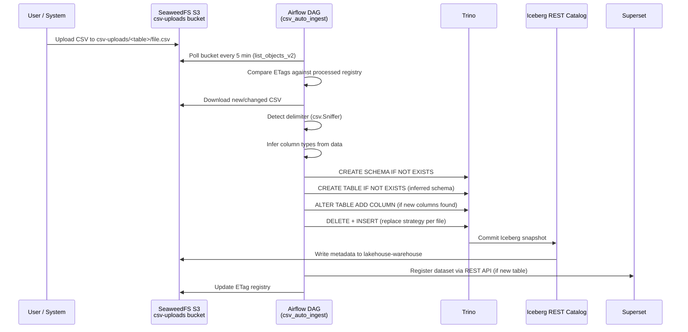
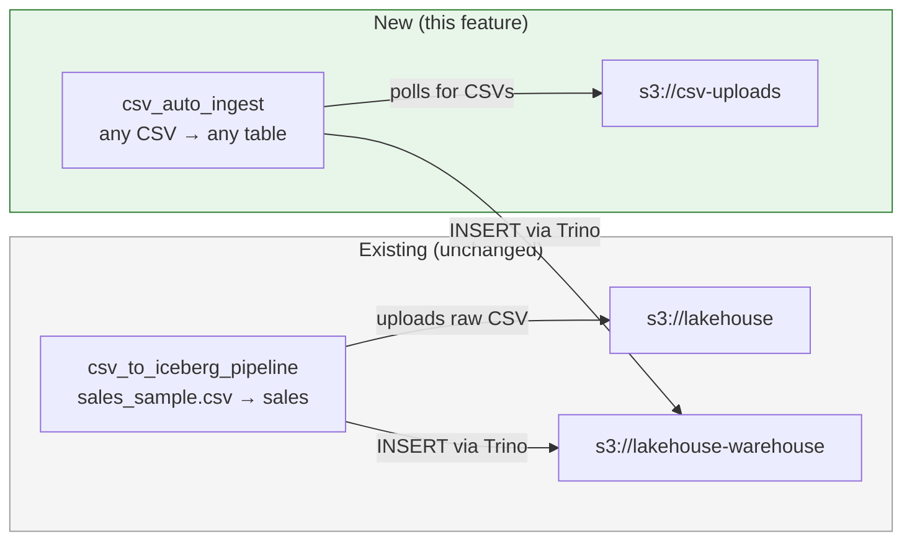
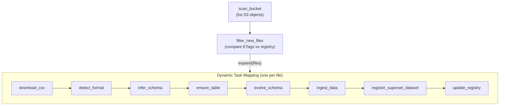
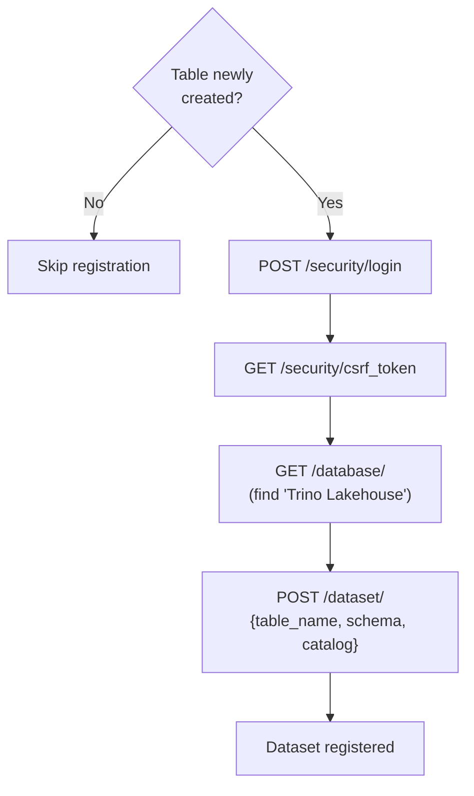

# Spec: CSV Auto-Ingest Pipeline

---

## Goal

Automatically detect, infer schema, and ingest arbitrary CSV files uploaded to a
dedicated S3 bucket (`csv-uploads`) into Apache Iceberg tables, making them
immediately queryable via Trino and visible in Superset -- without manual
configuration or schema definitions.

---

## Context

### Problem Statement

The existing ingestion pipeline (`csv_to_iceberg_pipeline`) processes a single
hardcoded CSV file (`sales_sample.csv`) with a known schema. Users who want to
query new datasets must modify DAG source code, define table schemas, and
manually register Superset datasets.

This feature eliminates that friction: upload a CSV to
`s3://csv-uploads/<table_name>/file.csv` and the system handles everything else.

### End-to-End Flow



### Relationship to Existing Components



The existing `csv_to_iceberg_pipeline` remains unchanged. The new DAG operates
on a separate bucket (`csv-uploads`) and creates tables in the same
`iceberg.lakehouse` schema.

---

## Requirements

### Functional Requirements

| ID | Requirement |
|----|-------------|
| FR-1 | A new S3 bucket `csv-uploads` must be created at stack startup alongside the existing `lakehouse` and `lakehouse-warehouse` buckets. |
| FR-2 | The DAG must poll the `csv-uploads` bucket every 5 minutes for new or modified CSV files. |
| FR-3 | The first-level directory in the bucket path determines the target Iceberg table name (e.g., `csv-uploads/customers/file.csv` maps to `iceberg.lakehouse.customers`). |
| FR-4 | The DAG must auto-detect the CSV delimiter using `csv.Sniffer` on the first 8 KB of the file. |
| FR-5 | The DAG must infer Iceberg column types from CSV data. Supported types: `VARCHAR`, `INTEGER`, `BIGINT`, `DOUBLE`, `BOOLEAN`, `DATE`, `TIMESTAMP`. Default fallback is `VARCHAR`. |
| FR-6 | The DAG must create the Iceberg namespace and table if they do not exist, using the inferred schema. |
| FR-7 | If a CSV has columns not present in an existing Iceberg table, the DAG must add them via `ALTER TABLE ADD COLUMN` (additive schema evolution). |
| FR-8 | Data ingestion must use a **replace** strategy: delete all rows associated with the source file, then insert the new data. The tracking key is `_source_file VARCHAR`. |
| FR-9 | Each file discovered during a polling cycle must be processed as a separate Airflow task, executing in parallel via the CeleryExecutor worker pool. |
| FR-10 | The DAG must track processed files by S3 ETag to avoid re-ingesting unchanged files. The ETag registry must be stored as an Iceberg table (`iceberg.lakehouse._ingest_registry`). |
| FR-11 | When a new Iceberg table is created, the DAG must automatically register a corresponding Superset dataset via the Superset REST API. |
| FR-12 | Every ingested row must include two audit columns: `_source_file VARCHAR` (S3 key of the source CSV) and `_ingested_at TIMESTAMP` (UTC timestamp of ingestion). |
| FR-13 | Files larger than 100 MB must trigger a warning in the Airflow logs but still be processed. |

### Non-Functional Requirements

| ID | Requirement |
|----|-------------|
| NFR-1 | The polling DAG must complete a scan of the `csv-uploads` bucket in under 10 seconds for up to 1000 objects. |
| NFR-2 | The DAG must be idempotent: re-running with the same files and ETags must not produce duplicate records or errors. |
| NFR-3 | The DAG must not interfere with the existing `csv_to_iceberg_pipeline` DAG or its data in `iceberg.lakehouse.sales`. |
| NFR-4 | Type inference must process the first 1000 rows to determine column types, falling back to `VARCHAR` for ambiguous columns. |
| NFR-5 | Table names derived from directory names must be sanitised: lowercased, non-alphanumeric characters replaced with underscores, prefixed with `_` if starting with a digit. |

---

## Architecture

### S3 Bucket Layout

```
s3://csv-uploads/
├── customers/
│   ├── q1_customers.csv         → iceberg.lakehouse.customers
│   └── q2_customers.csv         → iceberg.lakehouse.customers (appended)
├── products/
│   └── catalog_2024.csv         → iceberg.lakehouse.products
└── transactions/
    ├── jan_2024.csv             → iceberg.lakehouse.transactions
    └── feb_2024.csv             → iceberg.lakehouse.transactions
```

All CSVs under the same first-level directory map to the **same** Iceberg table.
Multiple files in a directory contribute rows to the same table, each tracked
independently by `_source_file`.

### Bucket Creation

The existing `s3-init` service in `docker-compose.yml` creates the `lakehouse`
and `lakehouse-warehouse` buckets on startup. It must be extended to also create
`csv-uploads`:

```bash
aws --endpoint-url http://seaweedfs-s3:8333 s3 mb s3://csv-uploads
```

### New Environment Variable

| Variable | Value | Purpose |
|----------|-------|---------|
| `S3_INGEST_BUCKET` | `csv-uploads` | Bucket to poll for auto-ingest CSVs |

This variable must be added to `.env` and injected into Airflow containers via
the `x-airflow-common` anchor in `docker-compose.yml`.

---

## DAG Design

### DAG Metadata

| Property | Value |
|----------|-------|
| `dag_id` | `csv_auto_ingest` |
| Schedule | `*/5 * * * *` (every 5 minutes) |
| `start_date` | `datetime(2024, 1, 1)` |
| `catchup` | `False` |
| `max_active_runs` | `1` |
| Tags | `["lakehouse", "iceberg", "auto-ingest"]` |
| Default retries | `2` |
| Retry delay | `30 seconds` |
| Owner | `data-engineering` |

### Task Flow



### Task Descriptions

| Task | Responsibility | Inputs | Outputs (XCom) |
|------|---------------|--------|----------------|
| `scan_bucket` | `list_objects_v2` on `csv-uploads`, collect keys and ETags for all `.csv` files | None | `[{key, etag, size, last_modified}]` |
| `filter_new_files` | Query `_ingest_registry` table for known ETags, return only files with new/changed ETags | Scan results | `[{key, etag, size, table_name}]` |
| `download_csv` | Download CSV from S3 to worker local filesystem (`/tmp/auto_ingest/`) | File metadata | `{local_path, key, size}` |
| `detect_format` | Read first 8 KB, use `csv.Sniffer` to detect delimiter and quoting, validate UTF-8 encoding | Local path | `{delimiter, quotechar, encoding}` |
| `infer_schema` | Read first 1000 rows with detected format, infer Iceberg types per column | Local path + format | `{columns: [{name, iceberg_type}]}` |
| `ensure_table` | `CREATE SCHEMA IF NOT EXISTS`, `CREATE TABLE IF NOT EXISTS` with inferred schema + `_source_file` + `_ingested_at` | Schema info | `{table_name, created: bool}` |
| `evolve_schema` | Compare inferred columns against existing table. `ALTER TABLE ADD COLUMN` for any missing columns. | Schema + table info | `{columns_added: [str]}` |
| `ingest_data` | `DELETE FROM table WHERE _source_file = ?`, then batch `INSERT INTO` with all rows + audit columns | All upstream | `{rows_inserted, rows_deleted}` |
| `register_superset_dataset` | If table was newly created, POST to Superset REST API to register dataset. Skip if exists. | Table creation flag | `{dataset_id, skipped: bool}` |
| `update_registry` | `INSERT INTO _ingest_registry` with file key, ETag, row count, timestamp, status | Ingest result | `{registered: bool}` |

### Dynamic Task Mapping

The `filter_new_files` task returns a list of file metadata dicts. Each
downstream task uses Airflow's `.expand()` to create one task instance per file.
With the CeleryExecutor, multiple files are processed in parallel across the
worker pool.

```python
files = filter_new_files(scan_bucket())

# Dynamic mapping: one task chain per file
downloads = download_csv.expand(file_meta=files)
formats = detect_format.expand(download_result=downloads)
schemas = infer_schema.expand(download_result=downloads, format_result=formats)
# ... etc.
```

---

## Type Inference

### Algorithm

For each column in the CSV:

1. Read the first 1000 non-empty values (skip blanks/nulls).
2. Attempt to parse each value through the type hierarchy (most specific first):
   - `BOOLEAN`: values in `{true, false, yes, no, 1, 0}` (case-insensitive)
   - `INTEGER`: matches regex `^-?\d+$` and fits in 32-bit range
   - `BIGINT`: matches regex `^-?\d+$` and exceeds 32-bit range
   - `DOUBLE`: matches regex `^-?\d+\.?\d*([eE][+-]?\d+)?$`
   - `DATE`: parseable by `datetime.strptime` with common formats (`YYYY-MM-DD`, `DD/MM/YYYY`, `MM/DD/YYYY`)
   - `TIMESTAMP`: parseable as ISO 8601 datetime
3. If >= 90% of non-empty values parse as a given type, assign that type.
4. If no type reaches the 90% threshold, fall back to `VARCHAR`.

### Type Mapping

| Inferred Type | Iceberg/Trino Type | Example Values |
|---------------|-------------------|----------------|
| `BOOLEAN` | `BOOLEAN` | `true`, `false`, `yes`, `no` |
| `INTEGER` | `INTEGER` | `42`, `-7`, `0` |
| `BIGINT` | `BIGINT` | `9999999999`, `-2147483649` |
| `DOUBLE` | `DOUBLE` | `3.14`, `-0.5`, `1.2e10` |
| `DATE` | `DATE` | `2024-01-15`, `15/01/2024` |
| `TIMESTAMP` | `TIMESTAMP(6)` | `2024-01-15T10:30:00Z` |
| `VARCHAR` (fallback) | `VARCHAR` | anything else |

---

## Ingest Registry

### Table: `iceberg.lakehouse._ingest_registry`

Tracks every file processed by the auto-ingest DAG.

| Column | Type | Description |
|--------|------|-------------|
| `file_key` | `VARCHAR` | S3 object key (e.g., `customers/q1.csv`) |
| `etag` | `VARCHAR` | S3 ETag (MD5 hash of content) |
| `table_name` | `VARCHAR` | Target Iceberg table name |
| `row_count` | `INTEGER` | Number of rows ingested |
| `status` | `VARCHAR` | `success` or `failed` |
| `error_message` | `VARCHAR` | Error details if status is `failed` |
| `ingested_at` | `TIMESTAMP(6)` | UTC timestamp of processing |
| `dag_run_id` | `VARCHAR` | Airflow DAG run ID for traceability |

### DDL

```sql
CREATE TABLE IF NOT EXISTS iceberg.lakehouse._ingest_registry (
    file_key      VARCHAR     NOT NULL,
    etag          VARCHAR     NOT NULL,
    table_name    VARCHAR     NOT NULL,
    row_count     INTEGER,
    status        VARCHAR     NOT NULL,
    error_message VARCHAR,
    ingested_at   TIMESTAMP(6) NOT NULL,
    dag_run_id    VARCHAR     NOT NULL
)
WITH (
    format = 'PARQUET'
);
```

### Lookup Logic

```sql
-- Check if a file has already been processed with the same ETag
SELECT 1
FROM iceberg.lakehouse._ingest_registry
WHERE file_key = ? AND etag = ? AND status = 'success'
LIMIT 1;
```

If a row matches, the file is skipped. If the ETag has changed (file was
re-uploaded), the file is re-processed and the old rows in the target table
are replaced (via `DELETE WHERE _source_file = ?`).

---

## Schema Evolution

### Additive Strategy

When a CSV contains columns not present in the existing Iceberg table:

1. Compare the inferred column list against the table's current schema
   (obtained via `DESCRIBE iceberg.lakehouse.<table>`).
2. For each missing column, execute:
   ```sql
   ALTER TABLE iceberg.lakehouse.<table>
   ADD COLUMN <column_name> <iceberg_type>;
   ```
3. New columns in old data files return `NULL` -- this is handled natively by
   Iceberg's schema evolution without rewriting any data.

### Column Name Sanitisation

CSV headers are sanitised before becoming Iceberg column names:

- Lowercase all characters
- Replace spaces and non-alphanumeric characters with underscores
- Collapse consecutive underscores
- Strip leading/trailing underscores
- Prefix with `col_` if the result is empty or starts with a digit

Example: `"Order ID  #"` becomes `order_id`.

---

## Superset Dataset Registration

When `ensure_table` creates a new Iceberg table (not a pre-existing one), the
pipeline registers a Superset dataset so the table is immediately available for
charting.

### Registration Flow



The registration reuses the same Superset API patterns as
`provision_dashboard.py` (session-based auth, CSRF token, idempotent checks).

---

## Data Ingestion Strategy

### Replace by Source File

The replace strategy is keyed on `_source_file`, not on the entire table:

```sql
-- Step 1: Delete all rows from this specific source file
DELETE FROM iceberg.lakehouse.<table>
WHERE _source_file = 'customers/q1_customers.csv';

-- Step 2: Insert all rows from the CSV with audit columns
INSERT INTO iceberg.lakehouse.<table>
    (col1, col2, ..., _source_file, _ingested_at)
VALUES
    (?, ?, ..., 'customers/q1_customers.csv', CURRENT_TIMESTAMP);
```

This ensures:
- Re-uploading a file replaces its data without affecting rows from other files
- Multiple files in the same directory coexist in the same table
- The operation is idempotent: re-running produces the same result

### Batch INSERT Optimisation

Unlike the existing DAG which inserts row-by-row, this pipeline should batch
inserts for better performance:

- Build INSERT statements with multiple value tuples (batch size: 500 rows)
- Each batch is a single Trino query: `INSERT INTO ... VALUES (...), (...), ...`
- This reduces Trino query overhead from O(n) to O(n/500)

---

## File Lifecycle

Files remain in the `csv-uploads` bucket after processing. The ETag-based
registry prevents re-ingestion of unchanged files. Users can:

- **Update data**: Re-upload a file with the same name but different content
  (different ETag triggers re-ingestion with replace)
- **Add data**: Upload additional files in the same directory (each file's rows
  are tracked independently by `_source_file`)
- **Remove data**: Delete a file from S3 (rows remain in Iceberg; manual
  cleanup via `DELETE WHERE _source_file = '...'` is required)

---

## Infrastructure Changes

### docker-compose.yml

| Change | Description |
|--------|-------------|
| `s3-init` command | Add `aws s3 mb s3://csv-uploads` to bucket creation |
| `x-airflow-common` environment | Add `S3_INGEST_BUCKET: csv-uploads` |

### .env

| Variable | Value | Description |
|----------|-------|-------------|
| `S3_INGEST_BUCKET` | `csv-uploads` | Bucket for auto-ingest CSVs |

### New Files

| File | Purpose |
|------|---------|
| `airflow/dags/csv_auto_ingest.py` | Main DAG: polling, discovery, dynamic task mapping |
| `airflow/dags/lib/type_inference.py` | Type inference engine (reusable module) |
| `airflow/dags/lib/schema_manager.py` | Table creation, schema evolution, DDL generation |
| `airflow/dags/lib/superset_client.py` | Superset REST API client for dataset registration |
| `airflow/dags/lib/__init__.py` | Package init |

### Existing File Changes

| File | Change |
|------|--------|
| `docker-compose.yml` | Add `csv-uploads` bucket to `s3-init`, add `S3_INGEST_BUCKET` env var |
| `.env` | Add `S3_INGEST_BUCKET=csv-uploads` |
| `openspec/roadmap.md` | Update Phase 2 status to reference this feature |

---

## Acceptance Criteria

- [ ] The `csv-uploads` bucket is created automatically at stack startup.
- [ ] Uploading a CSV to `s3://csv-uploads/test_table/data.csv` results in a
      queryable Iceberg table `iceberg.lakehouse.test_table` within 10 minutes.
- [ ] The inferred schema matches the CSV data types (integers are `INTEGER`,
      dates are `DATE`, etc.).
- [ ] Re-uploading the same file with identical content is skipped (no
      re-ingestion, verified via `_ingest_registry`).
- [ ] Re-uploading a file with changed content triggers re-ingestion and
      replaces the old data.
- [ ] Multiple CSV files in the same directory contribute rows to the same
      table, each tracked by `_source_file`.
- [ ] A CSV with columns not present in an existing table triggers `ALTER TABLE
      ADD COLUMN` without data loss.
- [ ] The delimiter is auto-detected for comma, semicolon, tab, and pipe
      delimited files.
- [ ] Audit columns `_source_file` and `_ingested_at` are present in every
      ingested row.
- [ ] New Iceberg tables are automatically registered as Superset datasets.
- [ ] The `_ingest_registry` table contains a record for every processed file
      with correct status, row count, and ETag.
- [ ] The existing `csv_to_iceberg_pipeline` DAG continues to function
      independently.
- [ ] Files larger than 100 MB produce a warning log but are still processed.
- [ ] The DAG handles an empty `csv-uploads` bucket without errors.
- [ ] Table names are sanitised (`My Data!` directory becomes `my_data` table).

---

## Failure Scenarios

| Scenario | Expected Behaviour |
|----------|-------------------|
| CSV with no header row | `csv.Sniffer` or header detection fails. The file is skipped, `_ingest_registry` records status `failed` with error message. |
| CSV with inconsistent column count | Rows with mismatched column counts are skipped. A warning is logged with line numbers. |
| Trino is unreachable | The `ensure_table` task retries (2 retries, 30s delay). If all retries fail, the task is marked failed. Other files in the same DAG run are not affected. |
| Superset is unreachable | Dataset registration fails gracefully (logged as warning). Data is still ingested into Iceberg. The dataset can be registered manually or on the next successful run. |
| File deleted from S3 between scan and download | The `download_csv` task fails with a 404. The file is recorded as `failed` in the registry. |
| Two files in the same directory have conflicting schemas | The second file triggers `ALTER TABLE ADD COLUMN` for any new columns. Existing columns retain their types. If a column exists with an incompatible type, the value is cast to the existing type or inserted as `NULL` on failure. |
| Concurrent DAG runs | `max_active_runs=1` prevents concurrent polling. A second trigger is queued. |
| Bucket does not exist | The `scan_bucket` task fails with a clear error. The DAG retries. |
| CSV with non-UTF-8 encoding | The `detect_format` task attempts to detect encoding. If detection fails, the file is skipped with status `failed`. |

---

## Implementation Tasks

The following tasks are ordered for parallel implementation where possible.
Dependencies are noted.

### Track 1: Infrastructure (no dependencies)

| Task | Description |
|------|-------------|
| T1.1 | Add `csv-uploads` bucket to `s3-init` service in `docker-compose.yml` |
| T1.2 | Add `S3_INGEST_BUCKET=csv-uploads` to `.env` and `x-airflow-common` environment |
| T1.3 | Create `airflow/dags/lib/__init__.py` package |

### Track 2: Core Library (no dependencies)

| Task | Description |
|------|-------------|
| T2.1 | Implement `airflow/dags/lib/type_inference.py` -- type detection for all supported types, 90% threshold logic, column name sanitisation |
| T2.2 | Implement `airflow/dags/lib/schema_manager.py` -- DDL generation, `CREATE TABLE`, `ALTER TABLE ADD COLUMN`, `DESCRIBE` parsing, batch INSERT builder |
| T2.3 | Implement `airflow/dags/lib/superset_client.py` -- Superset login, CSRF, find database, create dataset (extracted from `provision_dashboard.py` patterns) |

### Track 3: DAG (depends on Track 2)

| Task | Description |
|------|-------------|
| T3.1 | Implement `csv_auto_ingest.py` -- DAG definition, `scan_bucket`, `filter_new_files` tasks |
| T3.2 | Implement file processing tasks -- `download_csv`, `detect_format`, `infer_schema` |
| T3.3 | Implement data tasks -- `ensure_table`, `evolve_schema`, `ingest_data` |
| T3.4 | Implement registry + registration tasks -- `update_registry`, `register_superset_dataset` |
| T3.5 | Wire dynamic task mapping with `.expand()` and test end-to-end |

### Track 4: Documentation (parallel with all)

| Task | Description |
|------|-------------|
| T4.1 | Update `openspec/roadmap.md` with auto-ingest feature status |
| T4.2 | Update `README.md` with auto-ingest usage instructions and examples |
