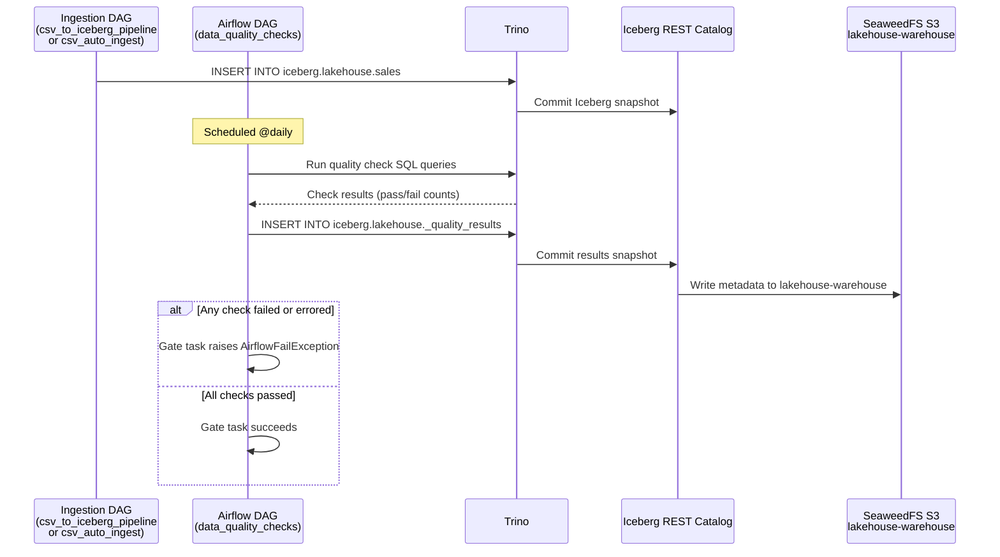
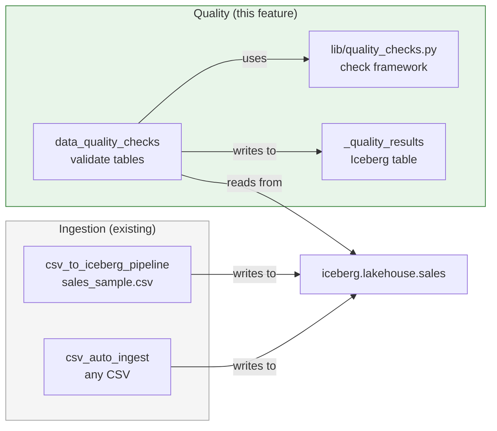
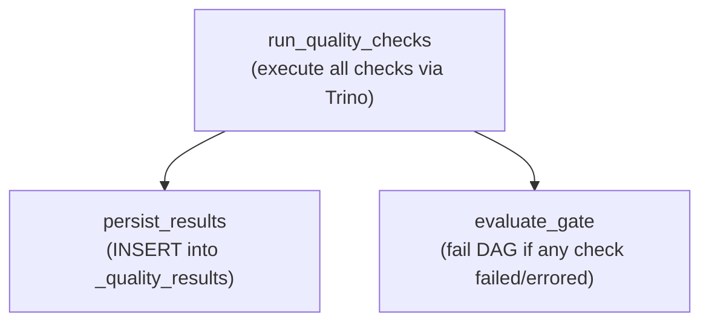

# Spec: Data Quality Checks

---

## Goal

Automatically validate data in Iceberg tables after ingestion using a declarative
check framework. Quality checks run as a separate Airflow DAG and act as a gate
-- failed checks prevent data from being considered "trusted" and generate
visible failures in Airflow.

---

## Context

### Problem Statement

The lakehouse ingests CSV data into Iceberg tables (via the existing
`csv_to_iceberg_pipeline` and `csv_auto_ingest` DAGs), but there is no
validation layer to catch data issues such as duplicates, null values in
required columns, out-of-range amounts, or unexpected category values. Bad data
flows through to Trino and Superset without any warning.

This feature adds a post-ingestion quality gate: a framework of SQL-based
checks that run against Iceberg tables, persist results to a metadata table, and
raise Airflow failures when checks do not pass.

### End-to-End Flow



### Relationship to Existing Components



The ingestion DAGs remain unchanged. The quality DAG is a separate, independent
DAG that reads from the same Iceberg tables and writes results to a dedicated
metadata table.

---

## Requirements

### Functional Requirements

| ID | Requirement |
|----|-------------|
| FR-1 | A declarative check framework (`lib/quality_checks.py`) must support 8 check types: uniqueness, not_null, accepted_values, positive, range, row_count_range, no_future_dates, and custom_sql. |
| FR-2 | Each check must execute as a SQL query against Trino and return a standardised `CheckResult` with status (passed/failed/error), failing row count, total row count, and a human-readable description. |
| FR-3 | A `data_quality_checks` DAG must run all configured checks, persist results to an Iceberg metadata table, and evaluate a pass/fail gate. |
| FR-4 | The gate task must raise `AirflowFailException` if any check has status `failed` or `error`, making the failure visible in the Airflow UI. |
| FR-5 | Check results must be persisted to `iceberg.lakehouse._quality_results` for historical querying via Trino and Superset. |
| FR-6 | A check suite for the `sales` table must be provided with 8 checks covering uniqueness, nullability, value ranges, accepted values, date validity, and row count bounds. |
| FR-7 | Unknown check types must return a result with status `error` and a descriptive message rather than raising an exception. |
| FR-8 | Check execution errors (e.g. Trino connection failures, SQL errors) must be caught and recorded as status `error` with the exception message in the details field. |

### Non-Functional Requirements

| ID | Requirement |
|----|-------------|
| NFR-1 | The check framework must be reusable: adding checks for a new table requires only creating `QualityCheck` instances, with no modifications to the framework itself. |
| NFR-2 | The DAG must be idempotent: re-running for the same execution date appends new result rows but does not corrupt or duplicate data in the target tables. |
| NFR-3 | The quality checks DAG must not interfere with the ingestion DAGs or modify any data in the tables being checked. |
| NFR-4 | Detail strings stored in `_quality_results` must be truncated to 1000 characters to prevent oversized metadata rows. |

---

## Architecture

### Components

| Component | Purpose |
|-----------|---------|
| `airflow/dags/lib/quality_checks.py` | Declarative check framework: data types, check executors, dispatcher, DDL builders, and the sales check suite. |
| `airflow/dags/data_quality_checks.py` | Airflow DAG: 3-task pipeline that runs checks, persists results, and evaluates the gate. |
| `iceberg.lakehouse._quality_results` | Iceberg table storing the historical record of all check executions. |

### Check Framework

The framework is built around two core data types and a dispatcher:

```python
@dataclass
class QualityCheck:
    """Declarative specification of a check to execute."""
    name: str            # Unique identifier (e.g. "sales_order_id_unique")
    check_type: str      # One of the 8 supported types
    table_name: str      # Target Iceberg table (without catalog/schema prefix)
    column_name: str | None = None   # Target column (None for table-level checks)
    params: dict[str, Any] = field(default_factory=dict)  # Type-specific params

@dataclass
class CheckResult:
    """Result of a single quality check execution."""
    check_name: str
    check_type: str
    table_name: str
    column_name: str | None
    status: CheckStatus    # passed, failed, or error
    failing_rows: int
    total_rows: int
    details: str
    executed_at: str       # UTC ISO timestamp
```

The `run_check(cursor, check)` dispatcher maps `check_type` to the
corresponding executor function, builds keyword arguments from the check
specification, and returns a `CheckResult`. Errors are caught and returned as
`CheckStatus.ERROR` rather than propagated as exceptions.

---

## Check Types

### Supported Checks

| Type | Column-Level | Description | SQL Pattern |
|------|:---:|-------------|-------------|
| `uniqueness` | Yes | Column has no duplicate non-null values | `SELECT COUNT(*) FROM (SELECT col, COUNT(*) FROM t WHERE col IS NOT NULL GROUP BY col HAVING COUNT(*) > 1)` |
| `not_null` | Yes | Column contains no NULL values | `SELECT COUNT(*) FROM t WHERE col IS NULL` |
| `accepted_values` | Yes | Column values belong to an allowed set | `SELECT COUNT(*) FROM t WHERE col IS NOT NULL AND col NOT IN (...)` |
| `positive` | Yes | Numeric column has only positive values (> 0) | `SELECT COUNT(*) FROM t WHERE col IS NOT NULL AND col <= 0` |
| `range` | Yes | Numeric column falls within [min, max] | `SELECT COUNT(*) FROM t WHERE col IS NOT NULL AND (col < min OR col > max)` |
| `row_count_range` | No | Table row count within [min, max] | `SELECT COUNT(*) FROM t` compared against bounds |
| `no_future_dates` | Yes | Date column has no future values | `SELECT COUNT(*) FROM t WHERE col IS NOT NULL AND col > CURRENT_DATE` |
| `custom_sql` | No | Arbitrary SQL returns zero failing rows | `SELECT COUNT(*) FROM (user_sql)` |

### Type-Specific Parameters

| Type | Required `params` | Example |
|------|-------------------|---------|
| `uniqueness` | None | -- |
| `not_null` | None | -- |
| `accepted_values` | `accepted: list[str]` | `{"accepted": ["Italy", "France", ...]}` |
| `positive` | None | -- |
| `range` | `min_value: float`, `max_value: float` | `{"min_value": 0.01, "max_value": 100000.0}` |
| `row_count_range` | `min_count: int`, `max_count: int` | `{"min_count": 1, "max_count": 100000}` |
| `no_future_dates` | None | -- |
| `custom_sql` | `sql: str` | `{"sql": "SELECT * FROM t WHERE ..."}` |

---

## Sales Table Check Suite

The initial deployment includes 8 checks against the `iceberg.lakehouse.sales`
table, defined as `SALES_CHECKS` in `lib/quality_checks.py`:

| # | Check Name | Type | Column | Parameters | Failure Meaning |
|---|-----------|------|--------|------------|-----------------|
| 1 | `sales_order_id_unique` | `uniqueness` | `order_id` | -- | Duplicate order IDs exist |
| 2 | `sales_order_id_not_null` | `not_null` | `order_id` | -- | Orders missing an ID |
| 3 | `sales_amount_positive` | `positive` | `amount` | -- | Negative or zero amounts |
| 4 | `sales_amount_reasonable_range` | `range` | `amount` | `min_value: 0.01`, `max_value: 100000.0` | Amounts outside business bounds |
| 5 | `sales_country_accepted` | `accepted_values` | `country` | `accepted: [Italy, Germany, France, United States, Spain, United Kingdom, Netherlands, Japan, Canada, Brazil]` | Unknown country codes |
| 6 | `sales_ingestion_date_not_future` | `no_future_dates` | `ingestion_date` | -- | Data timestamped in the future |
| 7 | `sales_row_count_reasonable` | `row_count_range` | -- | `min_count: 1`, `max_count: 100000` | Table is empty or suspiciously large |
| 8 | `sales_customer_id_not_null` | `not_null` | `customer_id` | -- | Orders missing a customer ID |

---

## Quality Results Table

### Table: `iceberg.lakehouse._quality_results`

Stores the outcome of every check execution for historical analysis.

| Column | Type | Description |
|--------|------|-------------|
| `check_name` | `VARCHAR` | Unique check identifier (e.g. `sales_order_id_unique`) |
| `check_type` | `VARCHAR` | Check type (e.g. `uniqueness`, `not_null`) |
| `table_name` | `VARCHAR` | Target table name (without catalog/schema prefix) |
| `column_name` | `VARCHAR` | Target column name (empty string for table-level checks) |
| `status` | `VARCHAR` | `passed`, `failed`, or `error` |
| `failing_rows` | `INTEGER` | Count of rows that failed the check |
| `total_rows` | `INTEGER` | Total rows in table at check time |
| `details` | `VARCHAR` | Human-readable description of the outcome (truncated to 1000 chars) |
| `dag_run_id` | `VARCHAR` | Airflow DAG run ID for traceability |
| `executed_at` | `TIMESTAMP(6)` | UTC timestamp of check execution |

### DDL

```sql
CREATE TABLE IF NOT EXISTS iceberg.lakehouse._quality_results (
    check_name    VARCHAR,
    check_type    VARCHAR,
    table_name    VARCHAR,
    column_name   VARCHAR,
    status        VARCHAR,
    failing_rows  INTEGER,
    total_rows    INTEGER,
    details       VARCHAR,
    dag_run_id    VARCHAR,
    executed_at   TIMESTAMP(6)
)
WITH (
    format = 'PARQUET'
);
```

### Query Examples

```sql
-- Latest results for the sales table
SELECT check_name, status, failing_rows, total_rows, details, executed_at
FROM iceberg.lakehouse._quality_results
WHERE table_name = 'sales'
ORDER BY executed_at DESC
LIMIT 20;

-- Failure trend over time
SELECT DATE(executed_at) AS check_date,
       COUNT(*) FILTER (WHERE status = 'failed') AS failures,
       COUNT(*) FILTER (WHERE status = 'passed') AS passes
FROM iceberg.lakehouse._quality_results
WHERE table_name = 'sales'
GROUP BY DATE(executed_at)
ORDER BY check_date DESC;
```

---

## DAG Design

### DAG Metadata

| Property | Value |
|----------|-------|
| `dag_id` | `data_quality_checks` |
| Schedule | `@daily` |
| `start_date` | `datetime(2024, 1, 1)` |
| `catchup` | `False` |
| `max_active_runs` | `1` |
| Tags | `["lakehouse", "iceberg", "data-quality"]` |
| Default retries | `1` |
| Retry delay | `60 seconds` |
| Owner | `data-engineering` |

### Task Flow



### Task Descriptions

| Task | Responsibility | Inputs | Outputs (XCom) |
|------|---------------|--------|----------------|
| `run_quality_checks` | Connect to Trino, iterate over `SALES_CHECKS`, call `run_check()` for each, collect results | `SALES_CHECKS` list | `[CheckResult.to_dict(), ...]` |
| `persist_results` | Ensure `_quality_results` table exists (DDL), INSERT each check result with the current `dag_run_id` | Check results from XCom | `{rows_inserted: int}` |
| `evaluate_gate` | Read check results from XCom, raise `AirflowFailException` if any result has status `failed` or `error` | Check results from XCom | None (succeeds or raises) |

### Task Dependencies

`persist_results` and `evaluate_gate` both depend on `run_quality_checks` and
run in parallel after it completes. This ensures that results are always
persisted to the metadata table even when the gate fails, preserving the
historical record for debugging.

### Gate Behaviour

The `evaluate_gate` task inspects all check results:

- If every check has status `passed`, the task succeeds silently.
- If any check has status `failed` or `error`, the task raises
  `AirflowFailException` with a summary of all failing checks. This marks the
  task (and the DAG run) as failed in the Airflow UI.

```python
from airflow.exceptions import AirflowFailException

failures = [r for r in results if r["status"] in ("failed", "error")]
if failures:
    summary = "; ".join(f"{f['check_name']}: {f['details']}" for f in failures)
    raise AirflowFailException(
        f"{len(failures)} quality check(s) failed: {summary}"
    )
```

---

## Extensibility

### Adding Checks for a New Table

Adding quality checks for a new table requires no changes to the framework.
Create `QualityCheck` instances and include them in the check list passed to
the DAG:

```python
from lib.quality_checks import QualityCheck

PRODUCTS_CHECKS = [
    QualityCheck(
        name="products_sku_unique",
        check_type="uniqueness",
        table_name="products",
        column_name="sku",
    ),
    QualityCheck(
        name="products_price_positive",
        check_type="positive",
        table_name="products",
        column_name="price",
    ),
]
```

### Custom SQL Checks

For complex business rules that cannot be expressed with the built-in check
types, use `custom_sql`. The provided SQL must return the set of failing rows;
the framework wraps it in a `COUNT(*)` to determine pass/fail:

```python
QualityCheck(
    name="sales_no_orphan_customers",
    check_type="custom_sql",
    table_name="sales",
    params={
        "sql": (
            "SELECT s.customer_id "
            "FROM iceberg.lakehouse.sales s "
            "LEFT JOIN iceberg.lakehouse.customers c "
            "  ON s.customer_id = c.id "
            "WHERE c.id IS NULL"
        )
    },
)
```

### Composing Check Suites

Check suites can be combined by concatenating lists:

```python
ALL_CHECKS = SALES_CHECKS + PRODUCTS_CHECKS + TRANSACTIONS_CHECKS
```

This allows a single DAG run to validate multiple tables, or separate DAGs can
be created per table with different schedules.

---

## Infrastructure Changes

### New Files

| File | Purpose |
|------|---------|
| `airflow/dags/lib/quality_checks.py` | Declarative check framework: data types, 8 check executors, dispatcher, DDL builders, sales check suite |
| `airflow/dags/data_quality_checks.py` | Airflow DAG: run checks, persist results, evaluate gate |

### Existing File Changes

| File | Change |
|------|--------|
| `openspec/roadmap.md` | Update Phase 3 status |

### No Infrastructure Dependencies

This feature requires no new containers, buckets, environment variables, or
Docker Compose changes. It uses the existing Trino connection to execute SQL
queries and write to Iceberg tables.

---

## Failure Scenarios

| Scenario | Expected Behaviour |
|----------|-------------------|
| Trino is unreachable | The `run_quality_checks` task fails with a connection error. Airflow retries (1 retry, 60s delay). No results are persisted for that run. |
| Target table does not exist | Individual check execution catches the SQL error and returns `CheckStatus.ERROR` with the exception message. Other checks continue. |
| `_quality_results` table does not exist | The `persist_results` task creates it via `CREATE TABLE IF NOT EXISTS` before inserting. |
| A check SQL times out | The Trino query timeout causes an exception, caught by `run_check()` and returned as `CheckStatus.ERROR`. |
| Unknown check type configured | The dispatcher returns `CheckStatus.ERROR` with message `"Unknown check type: <type>"`. The DAG continues with remaining checks. |
| All checks pass | The `evaluate_gate` task succeeds. The DAG run is marked successful. |
| One or more checks fail | The `evaluate_gate` task raises `AirflowFailException`. Results are still persisted by the parallel `persist_results` task. |
| DAG is re-run for the same date | New result rows are appended to `_quality_results`. No deduplication is needed since results are append-only historical records. |

---

## Acceptance Criteria

- [ ] A CSV with a negative `amount` triggers a quality check failure.
- [ ] A CSV with a duplicate `order_id` triggers a quality check failure.
- [ ] Quality check results are queryable through Trino (stored in
      `iceberg.lakehouse._quality_results`).
- [ ] Failed quality checks prevent the data from being promoted to the trusted
      layer (gate task raises `AirflowFailException`).
- [ ] Quality check history is visible in the Airflow UI as a separate task
      group.

---

## Implementation Tasks

### Track 1: Check Framework (no dependencies)

| Task | Description |
|------|-------------|
| T1.1 | Implement `lib/quality_checks.py` -- `CheckStatus` enum, `CheckResult` dataclass with `to_dict()` serialisation, `QualityCheck` dataclass |
| T1.2 | Implement 8 check executor functions: `check_uniqueness`, `check_not_null`, `check_accepted_values`, `check_positive`, `check_range`, `check_row_count_range`, `check_no_future_dates`, `check_custom_sql` |
| T1.3 | Implement `run_check()` dispatcher with error handling and unknown-type fallback |
| T1.4 | Implement DDL and INSERT builders: `build_quality_results_ddl()`, `build_quality_result_insert()` |
| T1.5 | Define `SALES_CHECKS` list with 8 quality checks for the sales table |

### Track 2: DAG (depends on Track 1)

| Task | Description |
|------|-------------|
| T2.1 | Implement `data_quality_checks.py` DAG definition with metadata (schedule, tags, retries) |
| T2.2 | Implement `run_quality_checks` task -- Trino connection, iterate checks, collect results to XCom |
| T2.3 | Implement `persist_results` task -- ensure `_quality_results` table, INSERT all results |
| T2.4 | Implement `evaluate_gate` task -- read results, raise `AirflowFailException` on any failure |

### Track 3: Documentation (parallel with all)

| Task | Description |
|------|-------------|
| T3.1 | Update `openspec/roadmap.md` with Phase 3 status |
