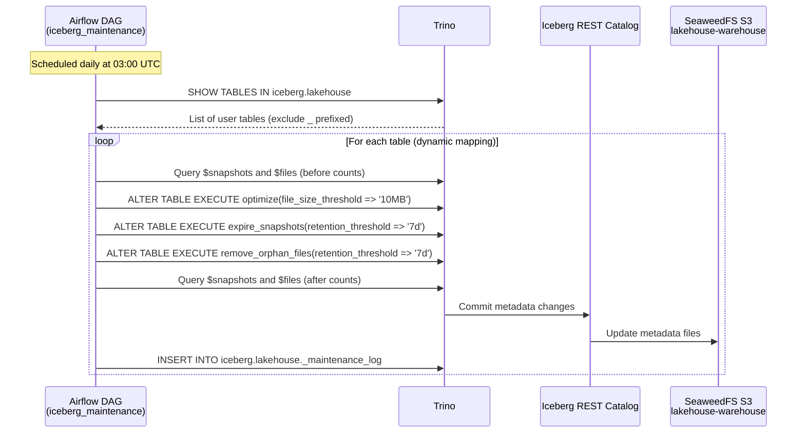
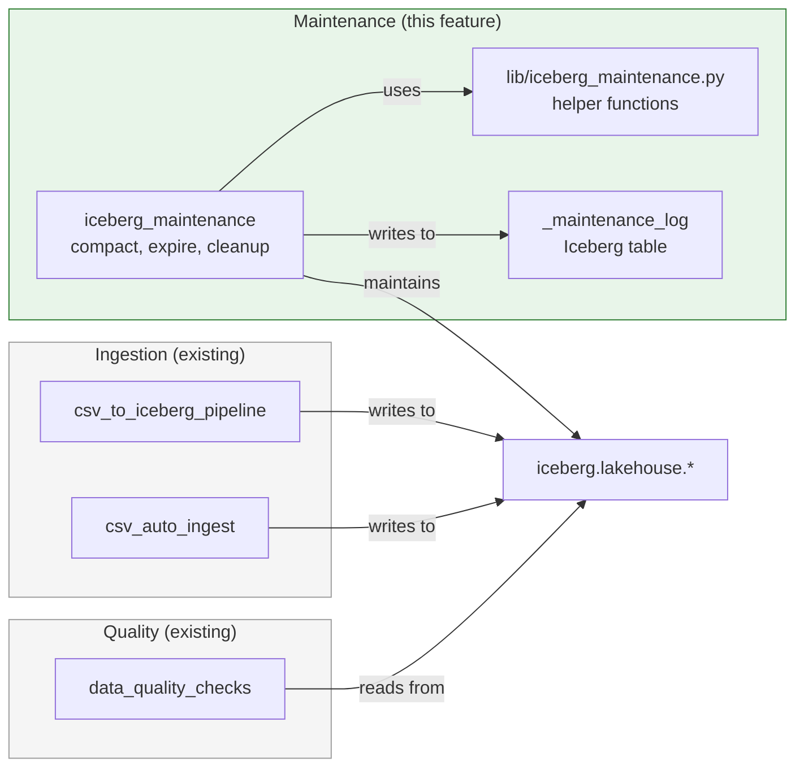
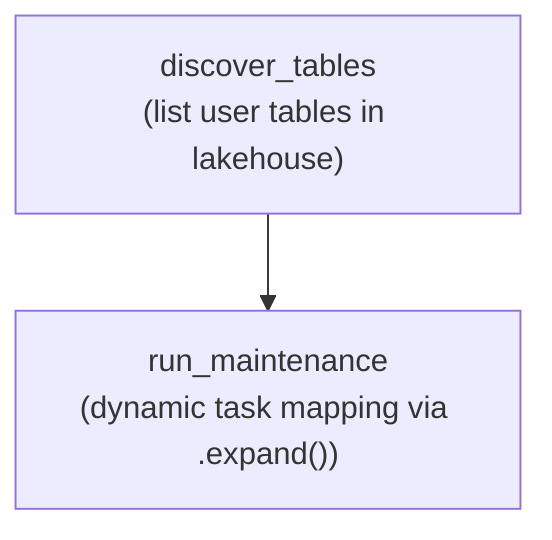

# Spec: Iceberg Maintenance

---

## Goal

Automated Iceberg table maintenance to manage storage growth, optimize query
performance, and ensure metadata hygiene. Without maintenance, Iceberg tables
accumulate small files, expired snapshots, and orphaned data files that degrade
performance and consume unnecessary storage.

---

## Context

### Problem Statement

As data is ingested into the lakehouse, each write operation creates new Parquet
data files and Iceberg snapshots. Over time this produces three categories of
waste:

1. **Small files** -- frequent, small-batch ingestion creates many undersized
   Parquet files. Each file adds metadata overhead and forces Trino to open more
   file handles during scans.
2. **Expired snapshots** -- every INSERT, DELETE, or UPDATE creates a new
   snapshot. Old snapshots reference data files that may no longer be needed,
   preventing storage reclamation.
3. **Orphan files** -- failed writes, aborted transactions, or snapshot expiry
   can leave Parquet files on S3 that are not referenced by any active snapshot.

Without automated maintenance, these issues compound over time, leading to
slower queries, bloated storage costs, and increasingly large metadata files.

### End-to-End Flow



### Relationship to Existing Components



The ingestion and quality DAGs remain unchanged. The maintenance DAG operates
independently and does not block concurrent read queries due to Iceberg's MVCC
(multi-version concurrency control) architecture.

---

## Requirements

### Functional Requirements

| ID | Requirement |
|----|-------------|
| FR-1 | A compaction operation must merge small Parquet files into larger ones when files fall below the size threshold. |
| FR-2 | A snapshot expiry operation must remove snapshots older than a configurable retention period (default: 7 days). |
| FR-3 | An orphan file cleanup operation must remove data files on S3 that are not referenced by any active snapshot. |
| FR-4 | The maintenance DAG must automatically discover all user tables in the `iceberg.lakehouse` schema, excluding metadata tables (prefixed with `_`). |
| FR-5 | Each maintenance run must record its operations to a `_maintenance_log` Iceberg table for historical querying. |
| FR-6 | A failure in one maintenance operation must not prevent the remaining operations from executing on the same table. |
| FR-7 | A failure maintaining one table must not prevent maintenance of other tables. |

### Non-Functional Requirements

| ID | Requirement |
|----|-------------|
| NFR-1 | Maintenance operations must not block concurrent read queries against the tables being maintained. |
| NFR-2 | The DAG must be idempotent: re-running for the same execution date appends new log rows but does not corrupt table state. |
| NFR-3 | The DAG must run daily without manual intervention. |
| NFR-4 | Maintenance history must be queryable via Trino and Superset. |

---

## Maintenance Operations

### Compaction (optimize)

Merges small Parquet files into larger ones to reduce metadata overhead and
improve scan performance.

**SQL:**

```sql
ALTER TABLE iceberg.lakehouse.<table>
EXECUTE optimize(file_size_threshold => '10MB')
```

**Behaviour:**

- Rewrites data files smaller than the threshold into consolidated files.
- Does not change the logical contents of the table.
- Produces a new snapshot containing references to the compacted files.
- Old data files are retained until snapshot expiry removes the snapshots that
  reference them.

### Snapshot Expiry

Removes snapshots older than the retention period, freeing storage from data
files that are only referenced by expired snapshots.

**SQL:**

```sql
ALTER TABLE iceberg.lakehouse.<table>
EXECUTE expire_snapshots(retention_threshold => '7d')
```

**Behaviour:**

- Deletes snapshot metadata older than the retention threshold.
- Data files referenced exclusively by expired snapshots are deleted from S3.
- Data files still referenced by a retained snapshot are preserved.
- The retention period is configurable (default: 7 days).

### Orphan File Cleanup

Removes data files on S3 that are not referenced by any active snapshot. These
files can result from failed writes, aborted transactions, or previous snapshot
expiry operations.

**SQL:**

```sql
ALTER TABLE iceberg.lakehouse.<table>
EXECUTE remove_orphan_files(retention_threshold => '7d')
```

**Behaviour:**

- Scans the table's data directory on S3 and compares against all file
  references in active snapshots.
- Deletes files not referenced by any snapshot that are older than the retention
  threshold.
- The retention threshold prevents deletion of files from in-progress writes.

---

## Architecture

### Components

| Component | Purpose |
|-----------|---------|
| `airflow/dags/lib/iceberg_maintenance.py` | Helper functions for each maintenance operation, maintenance log DDL/DML builders, and table discovery logic. |
| `airflow/dags/iceberg_maintenance.py` | Airflow DAG: discover tables, run maintenance per table via dynamic task mapping. |
| `iceberg.lakehouse._maintenance_log` | Iceberg table storing the historical record of all maintenance operations. |

### Helper Library: `lib/iceberg_maintenance.py`

The library provides:

- `get_user_tables(cursor)` -- queries `SHOW TABLES` and filters out `_`
  prefixed metadata tables.
- `get_snapshot_count(cursor, table)` -- returns the current snapshot count via
  the `$snapshots` metadata table.
- `get_file_count(cursor, table)` -- returns the current file count via the
  `$files` metadata table.
- `run_optimize(cursor, table)` -- executes the compaction operation.
- `run_expire_snapshots(cursor, table, retention)` -- executes snapshot expiry.
- `run_remove_orphan_files(cursor, table, retention)` -- executes orphan cleanup.
- `build_maintenance_log_ddl()` -- returns the `CREATE TABLE IF NOT EXISTS` DDL
  for the log table.
- `build_maintenance_log_insert(...)` -- returns the INSERT statement for a log
  entry.

---

## Maintenance Log Table

### Table: `iceberg.lakehouse._maintenance_log`

Stores the outcome of every maintenance operation for historical analysis and
operational monitoring.

| Column | Type | Description |
|--------|------|-------------|
| `table_name` | `VARCHAR` | Target table name (without catalog/schema prefix) |
| `operation` | `VARCHAR` | Operation type: `optimize`, `expire_snapshots`, or `remove_orphan_files` |
| `status` | `VARCHAR` | Outcome: `completed` or `failed` |
| `details` | `VARCHAR` | Human-readable summary of the operation outcome |
| `snapshots_before` | `INTEGER` | Snapshot count before the operation |
| `snapshots_after` | `INTEGER` | Snapshot count after the operation |
| `files_before` | `INTEGER` | File count before the operation |
| `files_after` | `INTEGER` | File count after the operation |
| `dag_run_id` | `VARCHAR` | Airflow DAG run ID for traceability |
| `executed_at` | `TIMESTAMP(6)` | UTC timestamp of the operation |

### DDL

```sql
CREATE TABLE IF NOT EXISTS iceberg.lakehouse._maintenance_log (
    table_name        VARCHAR,
    operation         VARCHAR,
    status            VARCHAR,
    details           VARCHAR,
    snapshots_before  INTEGER,
    snapshots_after   INTEGER,
    files_before      INTEGER,
    files_after       INTEGER,
    dag_run_id        VARCHAR,
    executed_at       TIMESTAMP(6)
)
WITH (
    format = 'PARQUET'
);
```

### Query Examples

```sql
-- Latest maintenance operations
SELECT table_name, operation, status, details,
       files_before, files_after, executed_at
FROM iceberg.lakehouse._maintenance_log
ORDER BY executed_at DESC
LIMIT 20;

-- Compaction effectiveness over time
SELECT DATE(executed_at) AS maintenance_date,
       table_name,
       files_before,
       files_after,
       files_before - files_after AS files_reduced
FROM iceberg.lakehouse._maintenance_log
WHERE operation = 'optimize'
  AND status = 'completed'
ORDER BY maintenance_date DESC;

-- Failed operations requiring investigation
SELECT table_name, operation, details, executed_at
FROM iceberg.lakehouse._maintenance_log
WHERE status = 'failed'
ORDER BY executed_at DESC;
```

---

## DAG Design

### DAG Metadata

| Property | Value |
|----------|-------|
| `dag_id` | `iceberg_maintenance` |
| Schedule | `0 3 * * *` (daily at 03:00 UTC) |
| `start_date` | `datetime(2024, 1, 1)` |
| `catchup` | `False` |
| `max_active_runs` | `1` |
| Tags | `["lakehouse", "iceberg", "maintenance"]` |
| Default retries | `1` |
| Retry delay | `60 seconds` |
| Owner | `data-engineering` |

### Schedule Rationale

The DAG runs at 03:00 UTC to target a low-traffic window. Maintenance operations
involve rewriting data files (compaction) and deleting orphaned files, which
consume I/O resources. Running during off-peak hours minimizes impact on
analytical queries.

### Task Flow



### Task Descriptions

| Task | Responsibility | Inputs | Outputs (XCom) |
|------|---------------|--------|----------------|
| `discover_tables` | Connect to Trino, list all tables in `iceberg.lakehouse`, filter out `_` prefixed metadata tables | None | `["sales", "products", ...]` |
| `run_maintenance` | For a single table: record before counts, run optimize, expire snapshots, remove orphan files, record after counts, log results | Table name from dynamic mapping | Maintenance log entries |

### Dynamic Task Mapping

The `run_maintenance` task uses Airflow's `.expand()` to create one task instance
per discovered table. This ensures:

- Each table is maintained independently.
- A failure maintaining one table does not block others.
- Airflow's UI shows per-table task status for debugging.

```python
tables = discover_tables()
run_maintenance.expand(table_name=tables)
```

### Error Handling

Each maintenance operation within `run_maintenance` is wrapped in a try/except
block:

```python
for operation in [run_optimize, run_expire_snapshots, run_remove_orphan_files]:
    try:
        operation(cursor, table_name)
        log_entry(table_name, operation.__name__, "completed", ...)
    except Exception as e:
        log_entry(table_name, operation.__name__, "failed", str(e), ...)
```

This ensures that a failure in compaction does not prevent snapshot expiry or
orphan cleanup from executing. All outcomes (success and failure) are recorded
in the maintenance log.

### Concurrency and MVCC

Iceberg's multi-version concurrency control guarantees that maintenance
operations do not block concurrent read queries:

- **Compaction** creates new data files and a new snapshot. Readers continue
  using the previous snapshot until the compaction commits.
- **Snapshot expiry** removes old snapshots but does not affect the current
  snapshot that readers are using.
- **Orphan cleanup** only deletes files not referenced by any snapshot, so
  active queries are unaffected.

---

## Failure Scenarios

| Scenario | Expected Behaviour |
|----------|-------------------|
| Trino is unreachable | The `discover_tables` task fails with a connection error. Airflow retries (1 retry, 60s delay). No maintenance is performed. |
| A table has no small files | The `optimize` operation completes as a no-op. No files are rewritten. Status is logged as `completed`. |
| A table has no expired snapshots | The `expire_snapshots` operation completes as a no-op. Status is logged as `completed`. |
| A table has no orphan files | The `remove_orphan_files` operation completes as a no-op. Status is logged as `completed`. |
| Compaction fails for one table | The failure is caught, logged as `failed`, and the remaining operations (expire, orphan cleanup) still execute. Other tables are unaffected. |
| `_maintenance_log` table does not exist | The task creates it via `CREATE TABLE IF NOT EXISTS` before inserting. |
| Concurrent ingestion during maintenance | Iceberg MVCC ensures no conflict. The ingestion creates a new snapshot; maintenance operates on the snapshot that existed when it started. |
| DAG is re-run for the same date | New log rows are appended to `_maintenance_log`. Maintenance operations are idempotent -- re-running compaction on already-compacted files is a no-op. |
| Storage quota exceeded during compaction | The compaction write fails. Iceberg does not commit the new snapshot. The table remains at the last successful state. |

---

## Acceptance Criteria

- [ ] Compaction reduces file count when files fall below the size threshold.
- [ ] Snapshot expiry removes snapshots older than the configured retention
      period.
- [ ] Orphan file cleanup reclaims storage from unreferenced data files.
- [ ] The DAG runs daily at 03:00 UTC without manual intervention.
- [ ] Maintenance operations do not block concurrent read queries.
- [ ] Maintenance history is queryable via Trino (stored in
      `iceberg.lakehouse._maintenance_log`).
- [ ] A failure in one operation does not prevent other operations from
      executing.
- [ ] A failure on one table does not prevent maintenance of other tables.

---

## Implementation Tasks

### Track 1: Helper Library (no dependencies)

| Task | Description |
|------|-------------|
| T1.1 | Implement `lib/iceberg_maintenance.py` -- table discovery function (`get_user_tables`) that lists tables and filters out `_` prefixed metadata tables |
| T1.2 | Implement snapshot and file count helper functions (`get_snapshot_count`, `get_file_count`) using Iceberg metadata tables |
| T1.3 | Implement maintenance operation functions (`run_optimize`, `run_expire_snapshots`, `run_remove_orphan_files`) |
| T1.4 | Implement DDL and INSERT builders (`build_maintenance_log_ddl`, `build_maintenance_log_insert`) |

### Track 2: DAG (depends on Track 1)

| Task | Description |
|------|-------------|
| T2.1 | Implement `iceberg_maintenance.py` DAG definition with metadata (schedule, tags, retries) |
| T2.2 | Implement `discover_tables` task -- Trino connection, table listing, metadata table filtering |
| T2.3 | Implement `run_maintenance` task with dynamic mapping via `.expand()` -- before/after counts, operation execution with error handling, log persistence |

### Track 3: Documentation (parallel with all)

| Task | Description |
|------|-------------|
| T3.1 | Update `openspec/roadmap.md` with Phase 6 status |
