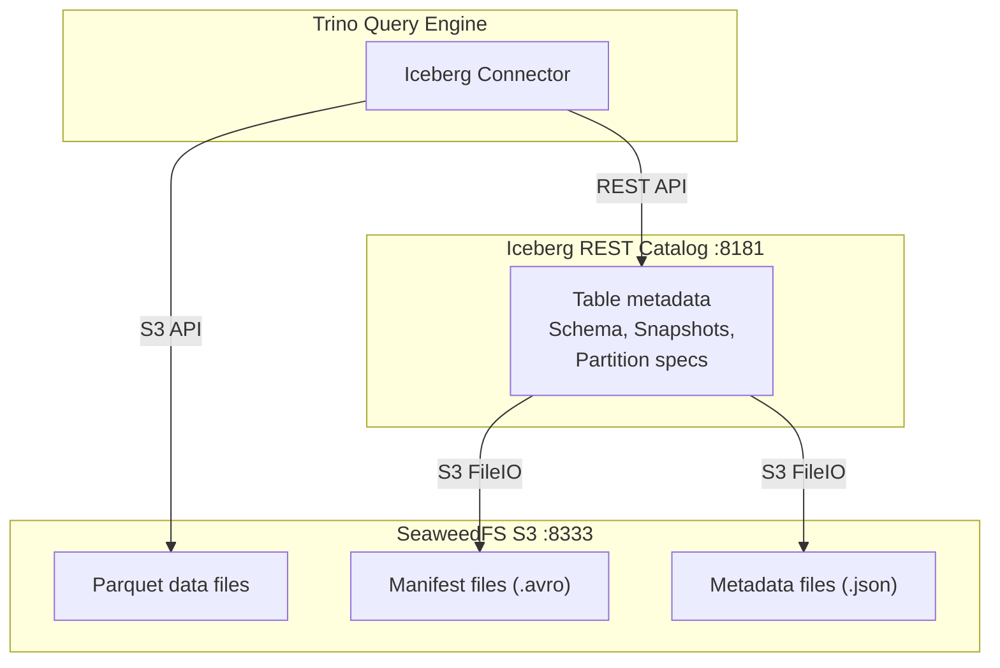
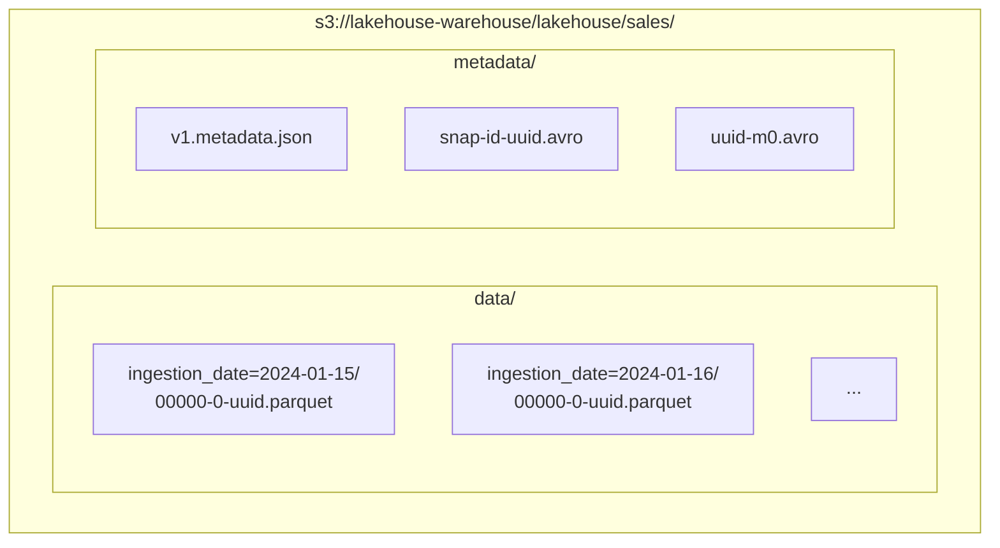
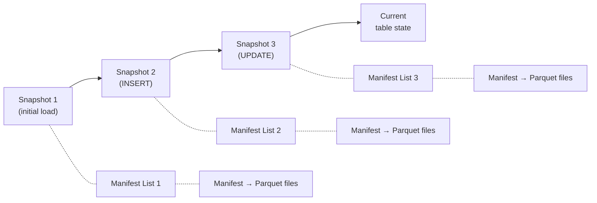

# Spec: Iceberg Table Design

---

## Goal

Define the Apache Iceberg table schema, partitioning strategy, file format, and
metadata management approach for the lakehouse sales dataset. The table must
support schema evolution, time travel queries, and efficient analytical access
through Trino.

---

## Context



Apache Iceberg is an open table format that brings ACID transactions,
schema evolution, and time travel to data lakes. In this platform, Iceberg
tables are the authoritative analytical representation of ingested data.

Trino connects to Iceberg using the native Iceberg connector configured with a
REST catalog. Data files are stored as Parquet on SeaweedFS (S3-compatible).
Iceberg metadata (manifest lists, manifests, and snapshots) are also stored on
SeaweedFS alongside the data files.

### Catalog Configuration

From `trino/catalog/iceberg.properties`:

```properties
connector.name=iceberg
iceberg.catalog.type=rest
iceberg.rest-catalog.uri=http://iceberg-rest:8181
iceberg.file-format=PARQUET
fs.native-s3.enabled=true
s3.endpoint=http://seaweedfs-s3:8333
s3.region=us-east-1
s3.path-style-access=true
```

---

## Requirements

### Functional Requirements

| ID | Requirement |
|----|-------------|
| FR-1 | Sales data must be stored as an Iceberg table in the `iceberg.lakehouse` schema. |
| FR-2 | The table must be partitioned by `ingestion_date` to enable efficient date-range queries. |
| FR-3 | Data files must be written in Parquet format. |
| FR-4 | The table must support adding new columns without rewriting existing data files. |
| FR-5 | Historical snapshots must be queryable via Trino's time travel syntax. |
| FR-6 | The table DDL must be idempotent (`CREATE TABLE IF NOT EXISTS`). |

### Non-Functional Requirements

| ID | Requirement |
|----|-------------|
| NFR-1 | Queries filtering on `ingestion_date` must benefit from partition pruning (only relevant partitions scanned). |
| NFR-2 | Parquet files should use Snappy compression as the default codec. |
| NFR-3 | Metadata operations (snapshot commits) must be atomic. |

---

## Table Schema Definition

### `iceberg.lakehouse.sales`

| Column | Iceberg Type | Nullable | Description |
|--------|-------------|----------|-------------|
| `order_id` | `VARCHAR` | No | Unique order identifier (e.g., `ORD-001`) |
| `customer_id` | `VARCHAR` | No | Customer identifier (e.g., `CUST-101`) |
| `amount` | `DECIMAL(12,2)` | No | Order amount in the transaction currency |
| `country` | `VARCHAR` | Yes | Country of the customer |
| `ingestion_date` | `DATE` | No | Date the record was ingested; also the partition key |

### DDL (Trino SQL)

```sql
CREATE TABLE IF NOT EXISTS iceberg.lakehouse.sales (
    order_id       VARCHAR     NOT NULL,
    customer_id    VARCHAR     NOT NULL,
    amount         DECIMAL(12,2) NOT NULL,
    country        VARCHAR,
    ingestion_date DATE        NOT NULL
)
WITH (
    format         = 'PARQUET',
    partitioning   = ARRAY['ingestion_date']
);
```

---

## Partitioning Strategy

### Partition Key: `ingestion_date`

The table is partitioned by the `ingestion_date` column using Iceberg's identity
transform. Each unique date value produces a separate partition directory
containing one or more Parquet data files.

### Rationale

| Factor | Justification |
|--------|---------------|
| **Query pattern** | Analytical queries on sales data almost always include a date range filter (`WHERE ingestion_date BETWEEN ...`). Partitioning by date enables Trino to skip irrelevant partitions entirely. |
| **Data arrival pattern** | New data arrives in daily batches. Each batch writes to a single partition, avoiding write amplification across many partitions. |
| **Partition cardinality** | Daily granularity produces approximately 365 partitions per year -- well within Iceberg's efficient range. Hourly or per-record partitioning would create excessive metadata overhead. |
| **Partition evolution** | If the query pattern shifts (e.g., frequently filtering by `country`), Iceberg allows adding a new partition field without rewriting historical data. New data will be dual-partitioned; old data remains partitioned by date only. |

### Physical Layout on S3



---

## Parquet Format Rationale

| Property | Benefit |
|----------|---------|
| **Columnar storage** | Analytical queries typically access a subset of columns. Parquet reads only the required columns, reducing I/O. |
| **Compression** | Snappy compression (Iceberg default) provides a strong balance of compression ratio and decompression speed. |
| **Predicate pushdown** | Parquet footer statistics (min/max per column per row group) enable Trino to skip row groups that cannot match the query predicate. |
| **Type richness** | Parquet natively supports `DECIMAL`, `DATE`, `TIMESTAMP`, nested types, and other complex schemas without lossy encoding. |
| **Ecosystem support** | Parquet is the de facto standard for analytical workloads. Every major query engine (Trino, Spark, DuckDB, Polars) reads Parquet natively. |

---

## Schema Evolution Capabilities

Iceberg tracks schema changes as metadata operations. No data files are
rewritten when the schema changes.

### Supported Operations

| Operation | Mechanism | Impact on Existing Data |
|-----------|-----------|------------------------|
| **Add column** | New column added to the current schema. Old data files return `NULL` for the new column. | None -- old files are not rewritten. |
| **Drop column** | Column removed from the schema. Old data files still contain the column, but it is no longer projected in queries. | None -- old files are not rewritten. |
| **Rename column** | Column name updated in the schema metadata. Iceberg uses field IDs (not names) to map columns, so renames are metadata-only. | None. |
| **Reorder columns** | Column order updated in the schema metadata. | None. |
| **Widen type** | Certain type promotions are allowed (e.g., `INT` to `BIGINT`, `FLOAT` to `DOUBLE`). | None -- old files with the narrower type are read and promoted on the fly. |

### Example: Adding a `currency` Column

```sql
ALTER TABLE iceberg.lakehouse.sales
ADD COLUMN currency VARCHAR;
```

After this operation:

- New data files include the `currency` column.
- Queries against old partitions return `NULL` for `currency`.
- No data files are rewritten or compacted.

---

## Time Travel and Snapshot Isolation

### Snapshot Model



Every write operation (INSERT, DELETE, UPDATE) creates a new snapshot. Each
snapshot is an immutable, complete view of the table at a point in time. Iceberg
retains a configurable history of snapshots.

### Querying Historical Snapshots

**By snapshot ID:**

```sql
SELECT * FROM iceberg.lakehouse.sales
FOR VERSION AS OF 123456789;
```

**By timestamp:**

```sql
SELECT * FROM iceberg.lakehouse.sales
FOR TIMESTAMP AS OF TIMESTAMP '2024-01-18 00:00:00';
```

### Use Cases

| Use Case | Benefit |
|----------|---------|
| **Debugging** | Compare current data against a previous snapshot to identify when a data quality issue was introduced. |
| **Auditing** | Prove the state of the data at a specific point in time for compliance or regulatory purposes. |
| **Rollback** | Revert the table to a previous snapshot if a bad write corrupts the data. |
| **Reproducible analytics** | Pin a dashboard or report to a specific snapshot so results are deterministic regardless of concurrent writes. |

### Snapshot Isolation

Concurrent readers and writers do not interfere with each other:

- **Readers** always see a consistent snapshot. A long-running query is not
  affected by concurrent writes.
- **Writers** produce new snapshots atomically. A failed write does not leave
  the table in an inconsistent state.

---

## Acceptance Criteria

- [ ] The `iceberg.lakehouse.sales` table exists and is queryable via Trino.
- [ ] The table is partitioned by `ingestion_date`.
- [ ] Data files are stored in Parquet format on SeaweedFS.
- [ ] Querying with a `WHERE ingestion_date = '2024-01-15'` filter scans only
      the corresponding partition (verifiable via `EXPLAIN`).
- [ ] Adding a column with `ALTER TABLE` does not trigger a data rewrite.
- [ ] Time travel queries by timestamp return the expected historical state.
- [ ] Re-running the `CREATE TABLE IF NOT EXISTS` DDL succeeds without error.

---

## Failure Scenarios

| Scenario | Expected Behaviour |
|----------|-------------------|
| Iceberg REST catalog is unreachable | Trino returns a connection error. Queries and DDL fail; data files on S3 are unaffected. |
| SeaweedFS is down during a write | The Parquet write fails. Iceberg does not commit a new snapshot, so the table remains in its previous consistent state. |
| Schema mismatch between Parquet and Iceberg metadata | Iceberg resolves columns by field ID, not by name or position. Mismatches result in `NULL` values for unresolvable columns rather than corrupted reads. |
| Snapshot metadata file is corrupted | Iceberg maintains a metadata log. The table can be recovered by rolling back to the previous valid metadata file. |
| Concurrent writes to the same partition | Iceberg uses optimistic concurrency control. The second writer detects a conflict and retries with the updated metadata. |
| Storage quota exceeded on SeaweedFS | Parquet write fails. Iceberg does not commit. The table remains at the last successful snapshot. |
