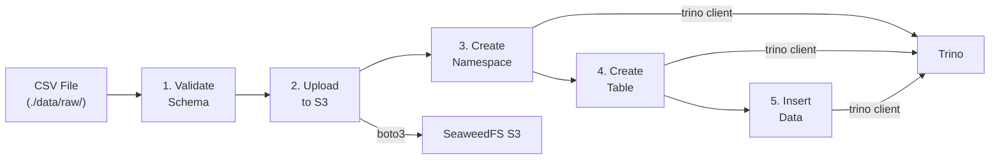
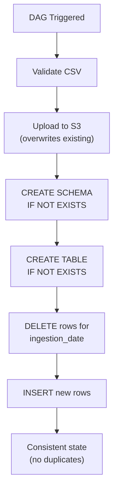

# Spec: CSV Ingestion Pipeline

---

## Goal

Implement a reliable, idempotent Airflow DAG that reads raw CSV files from the
local filesystem, validates their schema, converts them to Parquet, uploads them
to SeaweedFS via the S3 API, and registers the data as an Apache Iceberg table
queryable through Trino.

---

## Context

### Pipeline Flow



The platform ingests structured sales data from CSV files placed in the
`./data/raw/` directory. The initial dataset (`sales_sample.csv`) contains order
records with the following columns:

```
order_id, customer_id, amount, country, ingestion_date
```

This ingestion pipeline is the entry point for all data in the lakehouse. Every
downstream component (Iceberg tables, Trino queries, Superset dashboards)
depends on data flowing through this pipeline correctly.

The DAG runs inside an Airflow Celery worker and uses `boto3` to communicate
with SeaweedFS and `trino` (Python client) to issue DDL against the Iceberg
catalog.

---

## Requirements

### Functional Requirements

| ID | Requirement |
|----|-------------|
| FR-1 | The DAG must read the CSV file from `/opt/airflow/data/raw/sales_sample.csv` inside the worker container. |
| FR-2 | The DAG must validate the CSV schema against an expected column set before processing. |
| FR-3 | The DAG must upload the validated CSV file to the `lakehouse` S3 bucket at the path `raw/sales/sales_sample.csv`. |
| FR-4 | The DAG must create the Iceberg namespace (`iceberg.lakehouse`) and table (`sales`) via Trino DDL if they do not exist. |
| FR-5 | The DAG must insert data into the Iceberg table using a delete-then-insert pattern keyed on `ingestion_date` for idempotency. |
| FR-6 | The DAG must be idempotent: re-running the same DAG run for the same input file must not produce duplicate records or fail on conflict. |
| FR-7 | The DAG must log each stage (validation, upload, namespace creation, table creation, data insertion) with sufficient detail for debugging. |

### Non-Functional Requirements

| ID | Requirement |
|----|-------------|
| NFR-1 | The pipeline must complete within 5 minutes for files up to 100 MB. |
| NFR-2 | The DAG must be paused at creation (`dags_are_paused_at_creation: true`) to prevent accidental execution of untested pipelines. |
| NFR-3 | S3 credentials must be read from environment variables, never hardcoded in DAG source. |

---

## Schema Validation Rules

Validation runs before any data transformation to fail fast on malformed input.

| Rule | Description | Action on Failure |
|------|-------------|-------------------|
| **Column presence** | All expected columns (`order_id`, `customer_id`, `amount`, `country`, `ingestion_date`) must exist in the CSV header. | Raise `ValueError`; mark task as `failed`. |
| **No extra columns** | The CSV must not contain columns outside the expected set. Unexpected columns may indicate a schema change that requires review. | Raise `ValueError`; mark task as `failed`. |
| **Non-empty file** | The CSV must contain at least one data row beyond the header. | Raise `ValueError`; mark task as `failed`. |
| **Type coercion** | `amount` must be coercible to `DECIMAL`. `ingestion_date` must be coercible to `DATE` (ISO 8601). | Raise `TypeError`; mark task as `failed`. |
| **No null keys** | `order_id` and `customer_id` must not contain null or empty values. | Raise `ValueError`; mark task as `failed`. |

---

## S3 Upload Strategy

### Object Path Convention

```
s3://lakehouse/raw/sales/sales_sample.csv
```

### Upload Behaviour

- **Client**: `boto3.client('s3')` configured with the endpoint
  `http://seaweedfs-s3:8333`, access key, and secret key from environment
  variables.
- **Overwrite semantics**: `upload_file` overwrites any existing object at the
  same key. This supports idempotent re-runs without requiring a
  delete-then-upload pattern.
- **Content type**: `text/csv`.
- **Region**: `us-east-1` (SeaweedFS requires a region parameter but does not
  enforce geographic placement).

### Error Handling

| Failure Mode | Handling |
|-------------|----------|
| SeaweedFS unreachable | `boto3` raises `EndpointConnectionError`. Airflow retries the task per the DAG retry policy. |
| Authentication failure | `boto3` raises `ClientError` (403). Task fails immediately; operator must verify credentials. |
| Partial upload | S3 `put_object` is atomic for objects under 5 GB. No partial-upload recovery is needed for CSV-scale files. |

---

## Idempotency Guarantees



The pipeline is designed to be safely re-runnable:

| Concern | Strategy |
|---------|----------|
| **Duplicate S3 objects** | `put_object` overwrites the existing object at the same key. The final state is always the content of the latest run. |
| **Duplicate Iceberg records** | The table registration step uses `CREATE TABLE IF NOT EXISTS` or `INSERT OVERWRITE` semantics based on partition boundaries, preventing duplicate rows. |
| **Duplicate DAG runs** | Airflow's execution date provides a natural idempotency key. Re-triggering the same logical run replays the same input. |
| **Concurrent runs** | The Celery executor serialises tasks within a single DAG run. Separate DAG runs for different files are safe because they target different S3 keys. |

### Delete-then-Insert Scope

The idempotency strategy operates **per `ingestion_date`**, not per row or per
full table. For each distinct `ingestion_date` found in the CSV, the pipeline:

1. Deletes all existing rows in the Iceberg table for that date.
2. Inserts all rows from the CSV for that date.

This has important behavioural implications:

| Scenario | Result |
|----------|--------|
| **Re-run with identical CSV** | No change. Same rows are deleted and re-inserted. |
| **Remove some rows for a date that still has other rows** | Correct. All rows for that date are replaced with the CSV's current content. |
| **Remove all rows for a specific date from the CSV** | **Stale data remains.** The date is no longer in the CSV, so no DELETE is issued. Old rows for that date persist in Iceberg. |
| **Add rows with a new date** | Correct. DELETE finds nothing, INSERT adds the new rows. |

> **Known limitation:** The pipeline does not perform a full-table reconciliation.
> Dates that are removed entirely from the source CSV will retain their old data
> in the Iceberg table. A future enhancement could add a `MERGE`-based approach
> or a pre-insert step that deletes dates not present in the current CSV.

---

## Current Limitations

| Limitation | Description | Impact |
|-----------|-------------|--------|
| **Single-file only** | The DAG reads a hardcoded path (`/opt/airflow/data/raw/sales_sample.csv`). Additional CSV files placed in `data/raw/` are ignored. | Cannot ingest multiple source files without code changes. |
| **No orphan date cleanup** | Dates removed entirely from the CSV are not deleted from the Iceberg table (see Delete-then-Insert Scope above). | Stale data can accumulate if source dates are removed over time. |
| **Row-by-row INSERT** | Data is inserted one row at a time via parameterized Trino queries. | Acceptable for the sample dataset (~200 rows) but would be a bottleneck at scale. A future version should use bulk `INSERT INTO ... SELECT` from a staged external table. |
| **No Airflow Connections** | S3 and Trino connections are built directly from environment variables using `boto3` and `trino.dbapi`, bypassing Airflow's connection management. | Simplifies setup but sacrifices centralized credential management and the Connections UI. |
| **No data quality checks** | Validation is limited to schema column matching. No checks for data ranges, nulls in business-critical fields, or referential integrity. | Bad data (e.g., negative amounts, future dates) passes through unchecked. |

---

## Acceptance Criteria

- [x] Running the DAG with `sales_sample.csv` uploads the CSV to
      `s3://lakehouse/raw/sales/sales_sample.csv`.
- [x] The Iceberg table `iceberg.lakehouse.sales` is queryable via Trino and
      matches the source CSV row count and column types.
- [x] Running the same DAG a second time succeeds without errors and does not
      produce duplicate records in the Iceberg table.
- [ ] A CSV with a missing column causes the validation task to fail with a
      clear error message naming the missing column.
- [ ] A CSV with an unexpected extra column causes the validation task to fail.
- [ ] An empty CSV (header only) causes the validation task to fail.
- [x] S3 credentials are sourced from environment variables, not from DAG source
      code.
- [x] All task logs include timestamps and stage identifiers.

---

## Failure Scenarios

| Scenario | Expected Behaviour |
|----------|-------------------|
| CSV file is missing or path is incorrect | Task raises `FileNotFoundError`. DAG run is marked `failed`. No S3 upload occurs. |
| CSV schema does not match expected columns | Validation task raises `ValueError` with a message listing the discrepancy. Downstream tasks are skipped. |
| SeaweedFS S3 gateway is down | `boto3` raises `EndpointConnectionError`. Task retries per the configured retry policy (default: 3 retries with exponential backoff). |
| Trino is unreachable | Trino client raises `ConnectionError`. Table registration task fails; S3 data remains intact for manual recovery. |
| Disk full on Airflow worker | `pyarrow.parquet.write_table` raises `OSError`. Task fails. Operator must free disk space and re-trigger. |
| Malformed CSV (encoding errors, binary content) | `pandas.read_csv` raises `ParserError`. Task fails with a descriptive message. |
