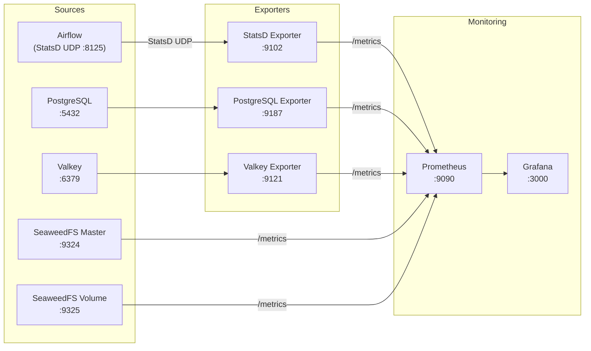
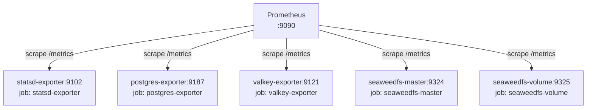
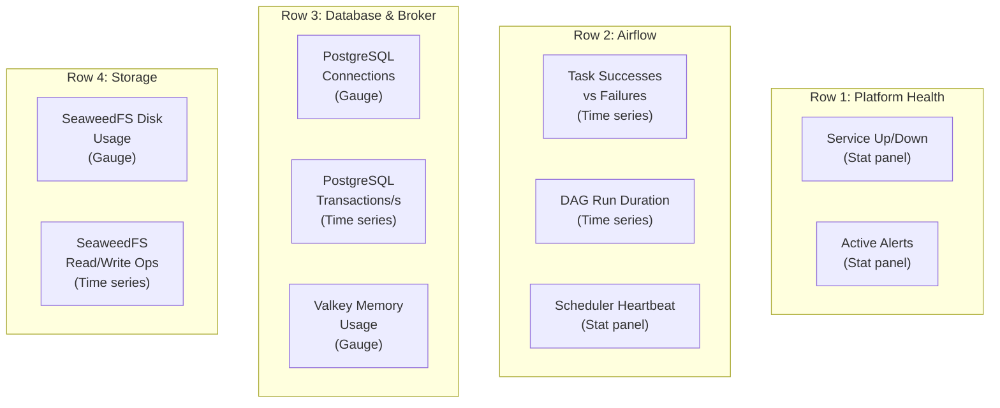
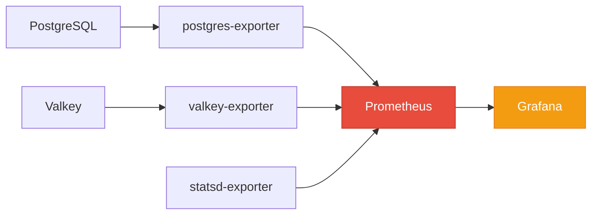

# Spec: Monitoring & Observability

---

## Goal

Provide comprehensive monitoring and observability for the lakehouse platform
using Prometheus for metrics collection and Grafana for dashboards and alerting.
Every service in the stack must expose metrics that are scraped, stored, and
visualised automatically with zero manual configuration after startup.

---

## Context

A distributed platform with independent containers (Airflow, PostgreSQL, Valkey,
SeaweedFS, Trino) requires centralised observability to detect failures, track
resource usage, and understand system behaviour over time. Without monitoring,
operators must inspect individual container logs to diagnose issues -- a
process that does not scale and misses correlated failures across services.

This specification adds a Prometheus-Grafana monitoring stack with exporters for
every service. Prometheus scrapes all targets every 15 seconds and retains data
for 7 days. Grafana auto-provisions a datasource and dashboard so that metrics
are visible immediately after `docker compose up`.

### Metrics Data Flow



### Components Involved

| Component | Container | Role |
|-----------|-----------|------|
| StatsD Exporter | `lakehouse-statsd-exporter` | Receives Airflow StatsD metrics over UDP, converts to Prometheus format |
| Prometheus | `lakehouse-prometheus` | Scrapes all metric endpoints, stores time-series data, evaluates alert rules |
| Grafana | `lakehouse-grafana` | Renders dashboards, manages alert notifications, provides query UI |
| PostgreSQL Exporter | `lakehouse-postgres-exporter` | Connects to PostgreSQL and exposes database statistics as Prometheus metrics |
| Valkey Exporter | `lakehouse-valkey-exporter` | Connects to Valkey and exposes broker statistics as Prometheus metrics |

---

## Requirements

### Functional Requirements

| ID | Requirement |
|----|-------------|
| FR-1 | Prometheus must scrape metrics from all services every 15 seconds. |
| FR-2 | Grafana must be accessible at `http://localhost:3000` with default credentials `admin/admin`. |
| FR-3 | Grafana must auto-provision a Prometheus datasource on first startup with no manual configuration. |
| FR-4 | Grafana must auto-provision the "Lakehouse Platform Overview" dashboard on first startup. |
| FR-5 | Airflow StatsD metrics must be received on UDP port 8125 by the StatsD exporter and exposed on `:9102/metrics`. |
| FR-6 | PostgreSQL connection counts, transaction rates, and table statistics must be exposed via the PostgreSQL exporter. |
| FR-7 | Valkey memory usage, connected clients, and command statistics must be exposed via the Valkey exporter. |
| FR-8 | SeaweedFS master and volume server metrics must be scraped from their native Prometheus endpoints. |
| FR-9 | Prometheus must evaluate five alert rules and surface firing alerts in Grafana. |
| FR-10 | Metrics must be retained for 7 days. |

### Non-Functional Requirements

| ID | Requirement |
|----|-------------|
| NFR-1 | All monitoring containers must start and become healthy within 60 seconds. |
| NFR-2 | The monitoring stack must not degrade the performance of the services it observes. Exporters must consume negligible CPU and memory. |
| NFR-3 | Prometheus must survive container restarts without data loss (volume-backed storage). |
| NFR-4 | Grafana dashboard state (provisioned dashboards and datasources) must persist across restarts. |

---

## New Containers

Five containers are added to the platform:

| Container | Image | Exposed Port | Internal Port | Purpose |
|-----------|-------|-------------|---------------|---------|
| `lakehouse-statsd-exporter` | `prom/statsd-exporter` | 9102 | 9102 (HTTP), 8125 (UDP) | Translates Airflow StatsD metrics to Prometheus format |
| `lakehouse-prometheus` | `prom/prometheus` | 9090 | 9090 | Central metrics collection, storage, and alert evaluation |
| `lakehouse-grafana` | `grafana/grafana` | 3000 | 3000 | Dashboard UI and alert management |
| `lakehouse-postgres-exporter` | `prometheuscommunity/postgres-exporter` | 9187 | 9187 | Exposes PostgreSQL statistics as Prometheus metrics |
| `lakehouse-valkey-exporter` | `oliver006/redis_exporter` | 9121 | 9121 | Exposes Valkey statistics as Prometheus metrics |

---

## StatsD Exporter

### Purpose

Airflow natively emits StatsD metrics for scheduler heartbeats, DAG processing
times, task instance state changes, pool usage, and executor queue depth. The
StatsD exporter receives these UDP datagrams and re-exposes them as Prometheus
metrics on an HTTP endpoint.

### Configuration

Airflow environment variables:

```
AIRFLOW__METRICS__STATSD_ON=True
AIRFLOW__METRICS__STATSD_HOST=statsd-exporter
AIRFLOW__METRICS__STATSD_PORT=8125
AIRFLOW__METRICS__STATSD_PREFIX=airflow
```

The StatsD exporter runs with a mapping configuration that converts Airflow's
dot-delimited metric names into labelled Prometheus metrics:

```yaml
mappings:
  - match: "airflow.dag.*.*.duration"
    name: "airflow_dag_task_duration"
    labels:
      dag_id: "$1"
      task_id: "$2"
  - match: "airflow.dagrun.duration.success.*"
    name: "airflow_dagrun_duration_success"
    labels:
      dag_id: "$1"
  - match: "airflow.dagrun.duration.failed.*"
    name: "airflow_dagrun_duration_failed"
    labels:
      dag_id: "$1"
  - match: "airflow.dag_processing.total_parse_time"
    name: "airflow_dag_processing_total_parse_time"
  - match: "airflow.scheduler.heartbeat"
    name: "airflow_scheduler_heartbeat"
  - match: "airflow.ti.failures"
    name: "airflow_ti_failures"
  - match: "airflow.ti.successes"
    name: "airflow_ti_successes"
```

### Key Metrics Exposed

| Metric | Type | Description |
|--------|------|-------------|
| `airflow_ti_failures` | Counter | Total task instance failures |
| `airflow_ti_successes` | Counter | Total task instance successes |
| `airflow_dag_task_duration` | Timer | Duration of individual task executions |
| `airflow_dagrun_duration_success` | Timer | Duration of successful DAG runs |
| `airflow_scheduler_heartbeat` | Counter | Scheduler heartbeat events |
| `airflow_dag_processing_total_parse_time` | Gauge | Time spent parsing all DAG files |

---

## Prometheus

### Scrape Configuration

```yaml
global:
  scrape_interval: 15s
  evaluation_interval: 15s

scrape_configs:
  - job_name: "statsd-exporter"
    static_configs:
      - targets: ["statsd-exporter:9102"]

  - job_name: "postgres-exporter"
    static_configs:
      - targets: ["postgres-exporter:9187"]

  - job_name: "valkey-exporter"
    static_configs:
      - targets: ["valkey-exporter:9121"]

  - job_name: "seaweedfs-master"
    static_configs:
      - targets: ["seaweedfs-master:9324"]

  - job_name: "seaweedfs-volume"
    static_configs:
      - targets: ["seaweedfs-volume:9325"]

rule_files:
  - "/etc/prometheus/alert_rules.yml"
```

### Storage

Prometheus data is persisted to a Docker volume (`prometheus-data`) mounted at
`/prometheus`. The `--storage.tsdb.retention.time=7d` flag limits storage to
7 days of metrics data.

### Health Check

```yaml
healthcheck:
  test: ["CMD", "wget", "--spider", "-q", "http://localhost:9090/-/healthy"]
  interval: 10s
  timeout: 5s
  retries: 5
```

### Scrape Targets Summary



---

## PostgreSQL Exporter

### Configuration

```
DATA_SOURCE_NAME=postgresql://<user>:<pass>@postgres:5432/<db>?sslmode=disable
```

### Key Metrics Exposed

| Metric | Type | Description |
|--------|------|-------------|
| `pg_stat_activity_count` | Gauge | Number of active connections by state |
| `pg_stat_database_tup_inserted` | Counter | Total rows inserted per database |
| `pg_stat_database_tup_updated` | Counter | Total rows updated per database |
| `pg_stat_database_tup_deleted` | Counter | Total rows deleted per database |
| `pg_stat_database_xact_commit` | Counter | Total committed transactions per database |
| `pg_stat_database_xact_rollback` | Counter | Total rolled-back transactions per database |
| `pg_settings_max_connections` | Gauge | Configured maximum connection limit |

---

## Valkey Exporter

### Configuration

```
REDIS_ADDR=redis://valkey:6379
```

The Valkey exporter uses the Redis wire protocol. No Valkey-specific
configuration is required.

### Key Metrics Exposed

| Metric | Type | Description |
|--------|------|-------------|
| `redis_memory_used_bytes` | Gauge | Total memory consumed by Valkey |
| `redis_memory_max_bytes` | Gauge | Configured maximum memory limit |
| `redis_connected_clients` | Gauge | Number of connected client connections |
| `redis_commands_processed_total` | Counter | Total commands processed |
| `redis_keyspace_hits_total` | Counter | Total key lookups that found a key |
| `redis_keyspace_misses_total` | Counter | Total key lookups that did not find a key |
| `redis_up` | Gauge | Whether Valkey is reachable (1 = up, 0 = down) |

---

## SeaweedFS Metrics

SeaweedFS exposes Prometheus metrics natively. No exporter sidecar is required.

| Component | Endpoint | Key Metrics |
|-----------|----------|-------------|
| Master | `:9324/metrics` | Volume count, topology stats, request rates |
| Volume | `:9325/metrics` | Disk usage, read/write bytes, object count |

---

## Grafana

### Provisioning

Grafana auto-provisions its configuration through files mounted into the
container:

```
/etc/grafana/provisioning/datasources/prometheus.yml   -- Prometheus datasource
/etc/grafana/provisioning/dashboards/dashboards.yml    -- Dashboard provider config
/var/lib/grafana/dashboards/lakehouse-overview.json    -- Dashboard JSON model
```

### Datasource Provisioning

```yaml
apiVersion: 1
datasources:
  - name: Prometheus
    type: prometheus
    access: proxy
    url: http://prometheus:9090
    isDefault: true
    editable: false
```

### Dashboard: Lakehouse Platform Overview

The dashboard is organised into 4 rows with 10 panels:



#### Panel Definitions

| # | Panel | Type | PromQL Query | Row |
|---|-------|------|-------------|-----|
| 1 | Service Up/Down | Stat | `up` | Platform Health |
| 2 | Active Alerts | Stat | `ALERTS{alertstate="firing"}` | Platform Health |
| 3 | Task Successes vs Failures | Time series | `rate(airflow_ti_successes[5m])`, `rate(airflow_ti_failures[5m])` | Airflow |
| 4 | DAG Run Duration | Time series | `airflow_dagrun_duration_success` | Airflow |
| 5 | Scheduler Heartbeat | Stat | `rate(airflow_scheduler_heartbeat[1m])` | Airflow |
| 6 | PostgreSQL Connections | Gauge | `pg_stat_activity_count` / `pg_settings_max_connections` * 100 | Database & Broker |
| 7 | PostgreSQL Transactions/s | Time series | `rate(pg_stat_database_xact_commit[5m])` | Database & Broker |
| 8 | Valkey Memory Usage | Gauge | `redis_memory_used_bytes` / `redis_memory_max_bytes` * 100 | Database & Broker |
| 9 | SeaweedFS Disk Usage | Gauge | `seaweedfs_disk_used_bytes` / `seaweedfs_disk_total_bytes` * 100 | Storage |
| 10 | SeaweedFS Read/Write Ops | Time series | `rate(seaweedfs_filer_request_total[5m])` | Storage |

### Grafana Credentials

| Setting | Value |
|---------|-------|
| Username | `admin` |
| Password | `admin` |
| URL | `http://localhost:3000` |
| Datasource | Auto-provisioned (Prometheus) |
| Dashboard | Auto-provisioned (Lakehouse Platform Overview) |

---

## Alert Rules

Prometheus evaluates alert rules every 15 seconds. Firing alerts are visible in
both the Prometheus UI (`http://localhost:9090/alerts`) and Grafana.

### Alert Rules Configuration

```yaml
groups:
  - name: lakehouse_alerts
    rules:
      - alert: AirflowTaskFailureHigh
        expr: increase(airflow_ti_failures[5m]) > 0
        for: 0m
        labels:
          severity: warning
        annotations:
          summary: "Airflow task failures detected"
          description: "{{ $value }} task failure(s) in the last 5 minutes."

      - alert: SeaweedFSDiskUsageHigh
        expr: (seaweedfs_disk_used_bytes / seaweedfs_disk_total_bytes) * 100 > 80
        for: 5m
        labels:
          severity: critical
        annotations:
          summary: "SeaweedFS disk usage exceeds 80%"
          description: "Disk usage is at {{ $value }}%. Free space or add volume servers."

      - alert: ValkeyMemoryHigh
        expr: (redis_memory_used_bytes / redis_memory_max_bytes) * 100 > 80
        for: 5m
        labels:
          severity: warning
        annotations:
          summary: "Valkey memory usage exceeds 80%"
          description: "Memory usage is at {{ $value }}%. Increase maxmemory or investigate queue depth."

      - alert: PostgresConnectionsHigh
        expr: (pg_stat_activity_count / pg_settings_max_connections) * 100 > 80
        for: 5m
        labels:
          severity: warning
        annotations:
          summary: "PostgreSQL connection usage exceeds 80%"
          description: "{{ $value }}% of max connections in use. Check for connection leaks."

      - alert: ServiceDown
        expr: up == 0
        for: 1m
        labels:
          severity: critical
        annotations:
          summary: "Scrape target {{ $labels.job }} is down"
          description: "Prometheus cannot reach {{ $labels.instance }} for more than 1 minute."
```

### Alert Summary

| Alert | Expression | For | Severity | Trigger Condition |
|-------|-----------|-----|----------|-------------------|
| AirflowTaskFailureHigh | `increase(airflow_ti_failures[5m]) > 0` | 0m | warning | Any task failure in a 5-minute window |
| SeaweedFSDiskUsageHigh | `(seaweedfs_disk_used / seaweedfs_disk_total) * 100 > 80` | 5m | critical | Disk usage above 80% for 5 minutes |
| ValkeyMemoryHigh | `(redis_memory_used / redis_memory_max) * 100 > 80` | 5m | warning | Memory usage above 80% for 5 minutes |
| PostgresConnectionsHigh | `(pg_stat_activity_count / pg_settings_max_connections) * 100 > 80` | 5m | warning | Connection usage above 80% for 5 minutes |
| ServiceDown | `up == 0` | 1m | critical | Any scrape target unreachable for 1 minute |

---

## Startup Order



The monitoring containers depend on their respective data sources:

| Container | Depends On | Condition |
|-----------|-----------|-----------|
| `postgres-exporter` | `postgres` | `service_healthy` |
| `valkey-exporter` | `valkey` | `service_healthy` |
| `statsd-exporter` | (none) | Starts independently; receives UDP passively |
| `prometheus` | `statsd-exporter`, `postgres-exporter`, `valkey-exporter` | `service_started` |
| `grafana` | `prometheus` | `service_healthy` |

---

## Volumes

| Docker Volume | Container | Mount Path | Contents |
|--------------|-----------|------------|----------|
| `prometheus-data` | `lakehouse-prometheus` | `/prometheus` | Time-series database (7-day retention) |
| `grafana-data` | `lakehouse-grafana` | `/var/lib/grafana` | Dashboard state, user preferences, alert history |

---

## Configuration Files

| File | Mounted To | Purpose |
|------|-----------|---------|
| `monitoring/prometheus/prometheus.yml` | `/etc/prometheus/prometheus.yml` | Scrape targets and global settings |
| `monitoring/prometheus/alert_rules.yml` | `/etc/prometheus/alert_rules.yml` | Alert rule definitions |
| `monitoring/statsd-exporter/statsd_mapping.yml` | `/tmp/statsd_mapping.yml` | StatsD-to-Prometheus metric name mapping |
| `monitoring/grafana/provisioning/datasources/prometheus.yml` | `/etc/grafana/provisioning/datasources/prometheus.yml` | Auto-provisioned Prometheus datasource |
| `monitoring/grafana/provisioning/dashboards/dashboards.yml` | `/etc/grafana/provisioning/dashboards/dashboards.yml` | Dashboard provider configuration |
| `monitoring/grafana/dashboards/lakehouse-overview.json` | `/var/lib/grafana/dashboards/lakehouse-overview.json` | Dashboard JSON model |

---

## Acceptance Criteria

- [ ] Prometheus scrapes metrics from all five targets (StatsD exporter,
      PostgreSQL exporter, Valkey exporter, SeaweedFS master, SeaweedFS volume)
      without errors. All targets show `UP` on the Prometheus targets page
      (`http://localhost:9090/targets`).
- [ ] Grafana dashboards display real-time metrics for Airflow, PostgreSQL,
      Valkey, and SeaweedFS without manual configuration after startup.
- [ ] The `AirflowTaskFailureHigh` alert fires when an Airflow task fails.
- [ ] The `SeaweedFSDiskUsageHigh` alert fires when SeaweedFS disk usage
      exceeds 80%.
- [ ] Metrics are retained for 7 days. Queries for data older than 7 days
      return no results; queries for data within the retention window succeed.
- [ ] Grafana is accessible at `http://localhost:3000` with credentials
      `admin/admin`.

---

## Failure Scenarios

| Scenario | Expected Behaviour |
|----------|-------------------|
| Prometheus is down | Grafana dashboards show "No data". Exporters continue running and accumulate metrics. When Prometheus recovers, scraping resumes but the gap period has no data. |
| Grafana is down | Dashboards are unavailable. Prometheus continues collecting and storing metrics. No data loss. Grafana state is restored from the `grafana-data` volume on restart. |
| StatsD exporter is down | Airflow StatsD UDP packets are silently dropped (UDP is fire-and-forget). Prometheus scrape for the `statsd-exporter` job shows `DOWN`. Airflow operation is unaffected. |
| PostgreSQL exporter cannot reach PostgreSQL | Exporter returns errors on `/metrics`. Prometheus records `up{job="postgres-exporter"} = 0`. The `ServiceDown` alert fires after 1 minute. |
| Valkey exporter cannot reach Valkey | Exporter returns errors on `/metrics`. Prometheus records `up{job="valkey-exporter"} = 0`. The `ServiceDown` alert fires after 1 minute. |
| SeaweedFS metrics endpoint unavailable | Prometheus scrape fails. Target shows `DOWN`. The `ServiceDown` alert fires after 1 minute. SeaweedFS operation is unaffected. |
| Prometheus storage volume is full | Prometheus stops accepting new samples and logs an error. Existing data remains queryable. Operator must free disk space or reduce the retention period. |
| All monitoring containers are stopped | The platform continues to operate normally. No metrics are collected during the outage. Restarting the monitoring stack resumes collection with a gap in historical data. |
