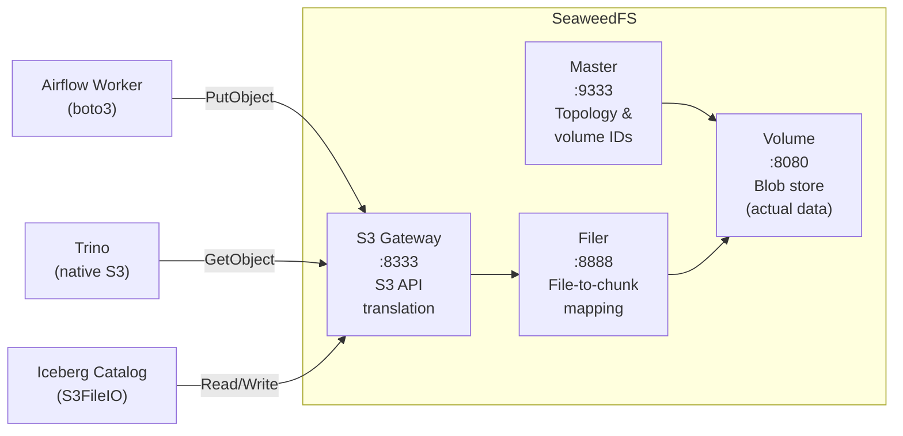
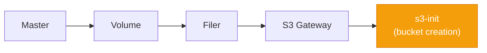
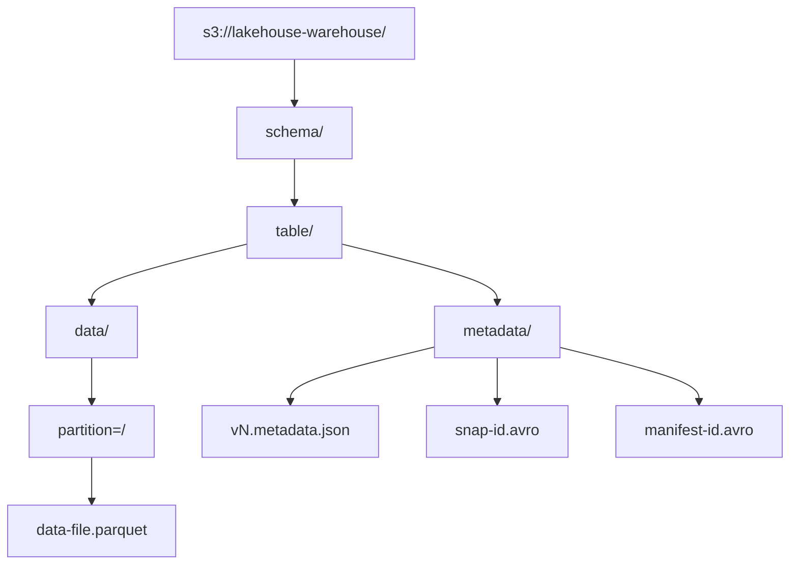

# Spec: Storage Layer (SeaweedFS)

---

## Goal

Provide a lightweight, S3-compatible object storage backend for the lakehouse
platform using SeaweedFS. The storage layer must support Parquet data files,
Iceberg metadata, and raw uploads from Airflow, all accessible through a
standard S3 API.

---

## Context

The lakehouse platform requires an object storage layer that satisfies three
clients:

1. **Airflow workers** upload Parquet files via `boto3` (AWS S3 SDK).
2. **Trino** reads Parquet data and Iceberg metadata through its native S3
   filesystem implementation.
3. **Iceberg** writes and reads manifest files, manifest lists, and table
   metadata through the S3 API.

All three clients use the S3 API exclusively. The storage backend must be
wire-compatible with the S3 protocol for `PutObject`, `GetObject`,
`ListObjectsV2`, `HeadObject`, `DeleteObject`, and `CreateBucket`.

---

## Requirements

### Functional Requirements

| ID | Requirement |
|----|-------------|
| FR-1 | SeaweedFS must expose an S3-compatible API on port 8333 (internal) / 8333 (host). |
| FR-2 | Two buckets must be created at startup: `lakehouse` (raw data) and `lakehouse-warehouse` (Iceberg tables). |
| FR-3 | `boto3`, Trino's native S3 client, and Iceberg's S3 file IO must all operate against SeaweedFS without modification. |
| FR-4 | Object data must persist across container restarts via Docker volumes. |
| FR-5 | S3 path-style access must be supported (`http://host:8333/bucket/key`). |
| FR-6 | Authentication must be enforced via access key and secret key. |

### Non-Functional Requirements

| ID | Requirement |
|----|-------------|
| NFR-1 | SeaweedFS must start and become ready within 30 seconds on commodity hardware. |
| NFR-2 | The storage layer must handle files up to 1 GB without configuration changes. |
| NFR-3 | The master, volume, filer, and S3 gateway must be independently restartable without data loss. |

---

## S3 API Compatibility

### Supported Operations

| S3 Operation | Used By | Purpose |
|-------------|---------|---------|
| `CreateBucket` | `s3-init` container | Creates `lakehouse` and `lakehouse-warehouse` buckets at startup |
| `PutObject` | Airflow worker | Uploads Parquet files to the `lakehouse` bucket |
| `GetObject` | Trino | Reads Parquet data files and Iceberg metadata |
| `HeadObject` | Trino, Iceberg | Checks object existence and retrieves metadata |
| `ListObjectsV2` | Trino, Iceberg | Lists objects in a prefix (partition discovery, manifest enumeration) |
| `DeleteObject` | Iceberg (future) | Removes expired snapshot files during compaction |

### Authentication

SeaweedFS S3 authentication is configured via `/etc/seaweedfs/s3-config.json`:

```json
{
  "identities": [
    {
      "name": "lakehouse_admin",
      "credentials": [
        {
          "accessKey": "lakehouse_access_key",
          "secretKey": "lakehouse_secret_key"
        }
      ],
      "actions": ["Admin", "Read", "Write", "List", "Tagging", "Lock"]
    }
  ]
}
```

The `lakehouse_admin` identity has full administrative access. In production,
separate identities with scoped permissions should be created for each client
(Airflow, Trino, Iceberg catalog).

---

## Architecture

SeaweedFS uses a four-component architecture, each deployed as a separate
container:



| Component | Container | Responsibility |
|-----------|-----------|---------------|
| **Master** | `lakehouse-seaweedfs-master` | Manages volume server topology, assigns volume IDs, tracks data placement. Exposes a metrics endpoint on port 9324. |
| **Volume** | `lakehouse-seaweedfs-volume` | Stores actual data blobs. Registers with the master on startup. Each volume server can host multiple logical volumes. |
| **Filer** | `lakehouse-seaweedfs-filer` | Provides a POSIX-like file interface on top of the volume servers. Maps file paths to blob chunks. Required by the S3 gateway. |
| **S3 Gateway** | `lakehouse-seaweedfs-s3` | Translates S3 API calls into filer operations. Clients interact exclusively with this component. |

### Startup Order



Each component depends on the previous one. Docker Compose `depends_on`
directives enforce this ordering.

---

## Bucket Structure

| Bucket | Purpose | Populated By |
|--------|---------|-------------|
| `lakehouse` | Raw data uploads (Parquet files converted from CSV) | Airflow workers |
| `lakehouse-warehouse` | Iceberg table data and metadata files | Iceberg / Trino |

### Bucket Creation

The `s3-init` container runs at startup, waits 15 seconds for the S3 gateway to
initialise, then creates both buckets using the AWS CLI:

```bash
aws --endpoint-url http://seaweedfs-s3:8333 s3 mb s3://lakehouse
aws --endpoint-url http://seaweedfs-s3:8333 s3 mb s3://lakehouse-warehouse
```

The `2>/dev/null || true` pattern makes bucket creation idempotent. If the
buckets already exist, the command succeeds silently.

---

## Object Naming Conventions

### Raw Data (`lakehouse` bucket)

```
s3://lakehouse/raw/<domain>/<filename>.parquet
```

Example:

```
s3://lakehouse/raw/sales/sales_sample.parquet
```

| Path Segment | Purpose |
|-------------|---------|
| `raw/` | Prefix indicating unprocessed data; distinguishes from curated or aggregated datasets |
| `<domain>/` | Logical data domain (e.g., `sales`, `inventory`, `customers`) |
| `<filename>.parquet` | Source file name with the Parquet extension |

### Iceberg Warehouse (`lakehouse-warehouse` bucket)



Iceberg manages the internal directory structure. The naming convention within
the `data/` and `metadata/` directories is controlled by the Iceberg library and
should not be manually modified.

---

## Why SeaweedFS

### License

SeaweedFS is licensed under Apache 2.0, a permissive open-source license. This
is important for a public portfolio project:

- No copyleft obligations -- downstream users are not required to open-source
  their modifications.
- No service-level restrictions (unlike AGPL, which requires source disclosure
  when the software is offered as a network service).
- Compatible with all other project dependencies.

### Lightweight Footprint

SeaweedFS is designed to run on commodity hardware with minimal resource
requirements. The master server uses approximately 30 MB of memory at idle, and
volume servers scale linearly with stored data. This makes it practical for
local development on a single machine while remaining production-capable.

### S3 Compatibility

The S3 gateway implements sufficient coverage of the S3 API for all platform
clients:

- `boto3` (Python AWS SDK) used by Airflow workers
- Trino's native S3 filesystem
- Iceberg's S3FileIO

Path-style access (`http://host:port/bucket/key`) is supported, which is
required for internal Docker networking where virtual-hosted-style access
(`bucket.host:port/key`) is not practical.

### Separated Concerns

The master/volume/filer/gateway architecture allows each component to be
independently scaled and restarted:

- Add volume servers for more storage capacity.
- Add S3 gateway instances behind a load balancer for more API throughput.
- Restart the filer without affecting in-flight volume reads.

---

## Volumes

| Docker Volume | Container | Contents |
|--------------|-----------|----------|
| `seaweedfs-master-data` | `lakehouse-seaweedfs-master` | Volume topology, ID assignments |
| `seaweedfs-volume-data` | `lakehouse-seaweedfs-volume` | Actual data blobs (Parquet files, Iceberg metadata) |
| `seaweedfs-filer-data` | `lakehouse-seaweedfs-filer` | File-path-to-chunk mapping database |

---

## Acceptance Criteria

- [ ] The `lakehouse` and `lakehouse-warehouse` buckets exist after initial
      startup.
- [ ] `aws s3 ls --endpoint-url http://localhost:8333` lists both buckets.
- [ ] Uploading a file with `boto3` to `s3://lakehouse/test.txt` succeeds and
      the file is retrievable.
- [ ] Trino can read Parquet files from `s3://lakehouse-warehouse/` through the
      Iceberg connector.
- [ ] Restarting the SeaweedFS containers preserves all stored objects.
- [ ] Authentication is required; requests without valid credentials are
      rejected with HTTP 403.

---

## Failure Scenarios

| Scenario | Expected Behaviour |
|----------|-------------------|
| S3 gateway is down | `boto3` raises `EndpointConnectionError`. Trino queries against Iceberg tables fail with a connection error. Data on volume servers is unaffected. |
| Volume server crashes | Master detects the lost volume. Reads for objects on that volume fail until recovery. With replication (not enabled by default), reads are served from replicas. |
| Master server crashes | Volume and filer servers continue to serve existing data. New writes that require volume allocation fail until the master recovers. |
| Filer crashes | S3 gateway cannot resolve file paths. All S3 operations fail. Volume data is intact and recoverable when the filer restarts and rebuilds its index. |
| Disk full on volume server | Write operations fail with an error. Existing data remains readable. Operator must add storage or clean up unused objects. |
| S3 init runs before gateway is ready | The init container waits 15 seconds and retries. The `|| true` pattern prevents the container from exiting with an error if the bucket already exists. |
| Credential mismatch | S3 gateway returns HTTP 403 (Forbidden). Client must verify access key and secret key match the values in `s3-config.json`. |
